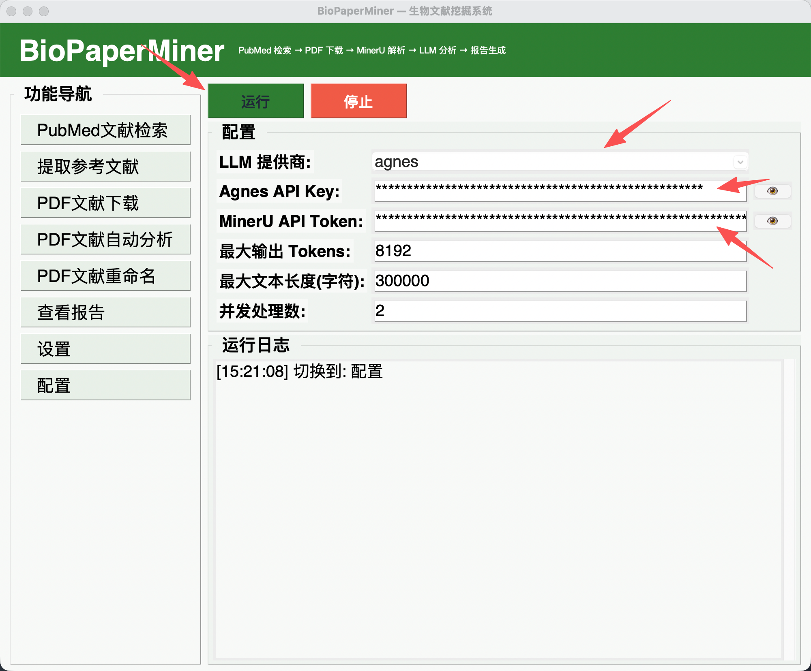
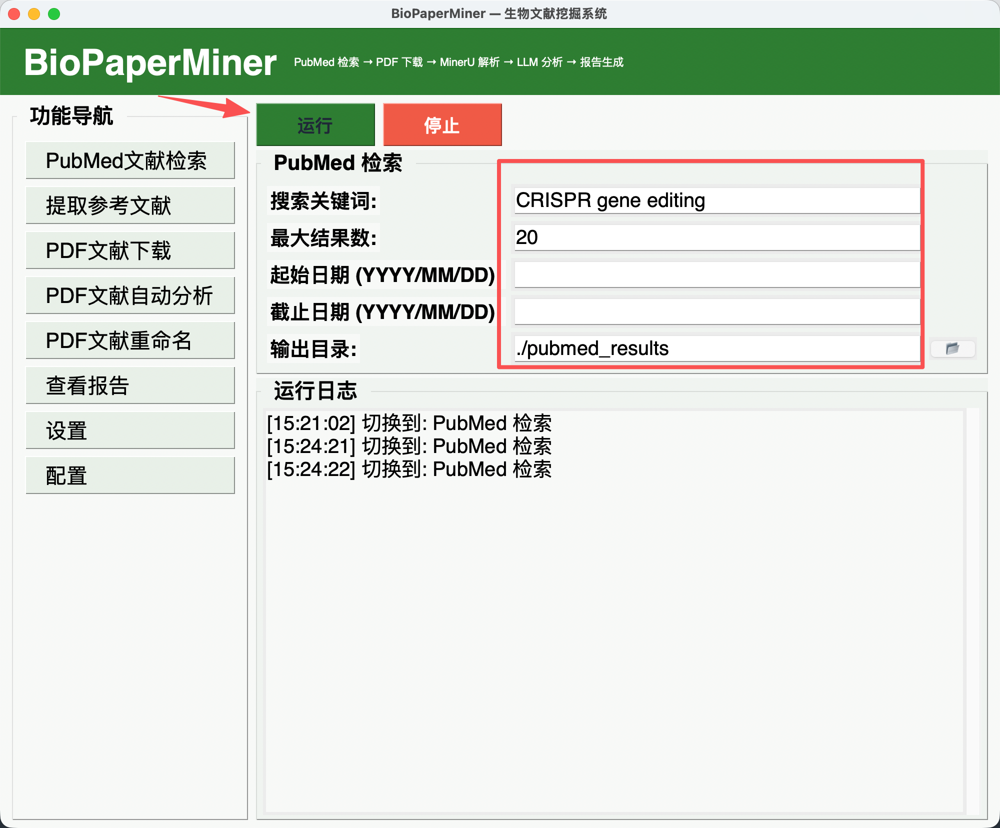
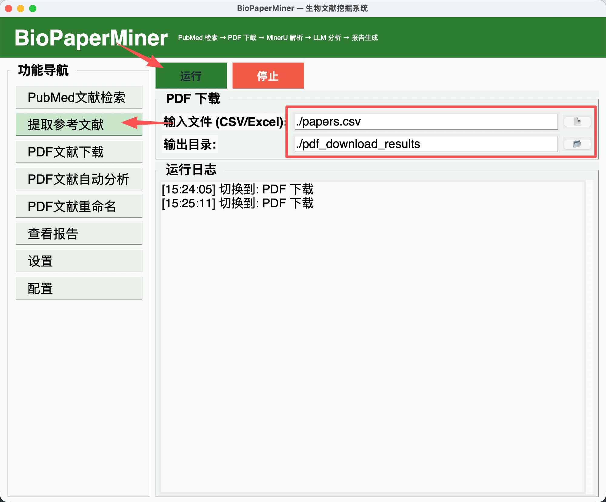
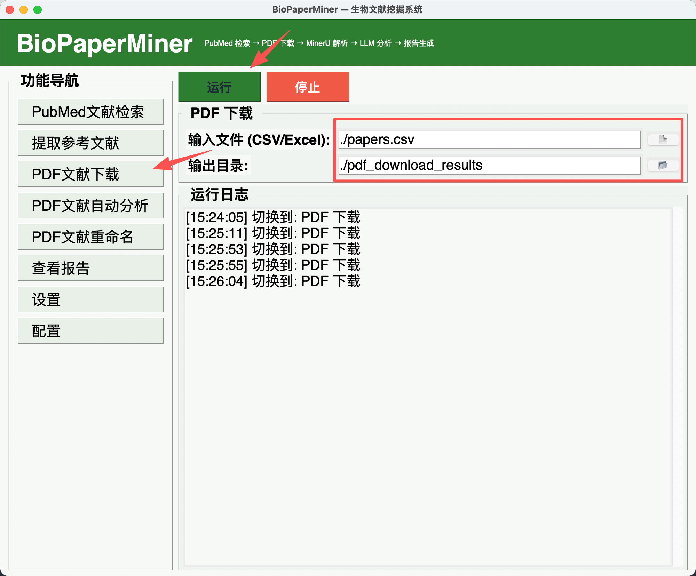
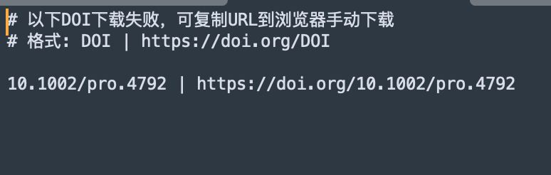
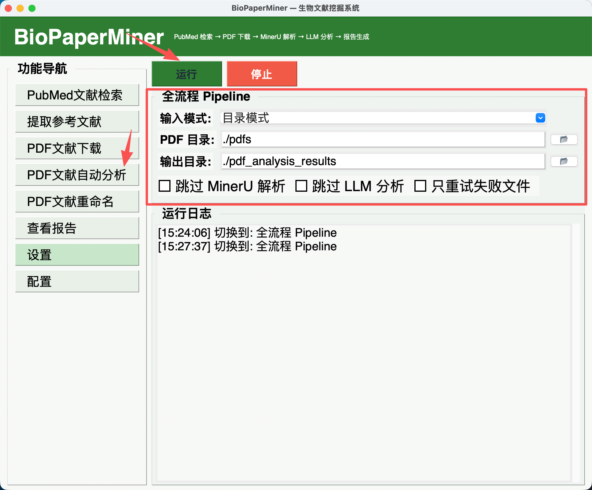
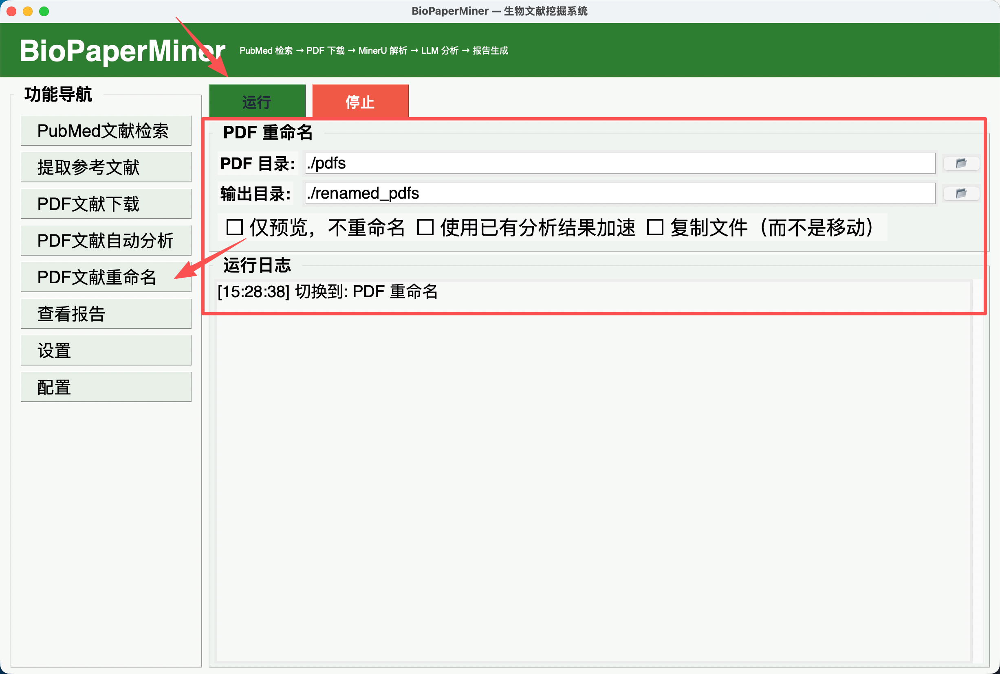
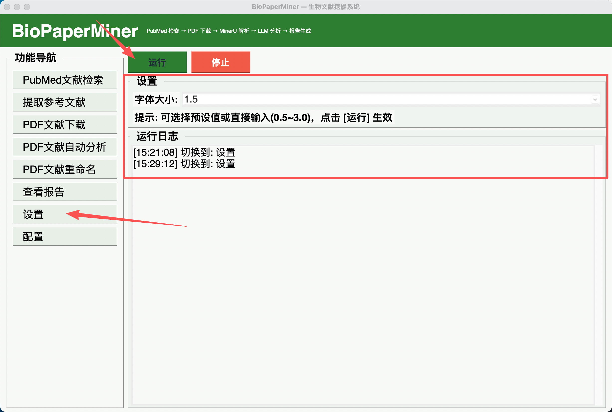

# BioPaperMiner 用户手册

## 目录

1. [配置说明](#1-配置说明)
2. [PubMed文献检索](#2-pubmed文献检索)
3. [提取参考文献](#3-提取参考文献)
4. [PDF文献下载](#4-pdf文献下载)
5. [PDF文献自动分析](#5-pdf文献自动分析)
6. [PDF文献重命名](#6-pdf文献重命名)
7. [查看报告](#7-查看报告)
8. [设置](#8-设置)
9. [常见问题](#9-常见问题)

---

## 1. 配置说明

### 1.1 LLM 配置

软件默认使用 **Agnes AI** 作为 LLM 提供商。

| 配置项 | 说明 |
|---|---|
| **LLM 提供商** | 可选：Agnes / DeepSeek / Ollama / OpenAI 兼容 |
| **Agnes API Key** | 填入你的 Agnes API 密钥 |
| **DeepSeek API Key** | 使用 DeepSeek 时填入 |
| **MinerU API Token** | PDF 解析必需，用于调用 MinerU 接口 |
| **Ollama 地址** | 本地模型时填写，默认 `http://localhost:11434` |
| **Ollama 模型名** | 默认 `gemma4:26b` |

### 1.2 获取 API Key

| 服务 | 注册地址 | 说明 |
|---|---|---|
| **Agnes AI** | https://platform.agnes-ai.com | 推荐，免费 |
| **DeepSeek** | https://platform.deepseek.com | 备选方案 |
| **MinerU** | https://mineru.net | PDF 解析必需 |

### 1.3 配置方式

方式一：**通过 GUI 配置面板（推荐）**
1. 点击左侧导航栏的「配置」
2. 选择 LLM 提供商（默认 Agnes）
3. 填入对应的 API Key
4. 点击「运行」保存并测试连接

**方式二：环境变量**
```bash
export AGNES_API_KEY="sk-你的Key"
export MINERU_API_TOKEN="你的MinerU令牌"
```

**方式三：直接编辑配置文件**
打开 `biopaperminer/config.py`，修改对应值。

### 1.4 连接测试

配置完成后点击「运行」，程序会自动测试 LLM 连接。如果连接失败：
- 检查 API Key 是否填写正确
- 检查网络是否能正常访问 API 服务
- 如使用代理，在「PubMed文献检索」模块中配置代理地址
- 如果给定的Agnes API Keys没有跑通，说明coding plan已经结束，可以换成免费的API：sk-tfBwl9sQDCh9XKc5eCojedfDm29TI0lltWTsGU1IYv8PWRKV



---

## 2. PubMed文献检索

### 功能说明
通过关键词检索 PubMed 数据库，获取文献的标题、摘要、DOI、作者等信息，支持多种格式导出。

### 参数说明

| 参数 | 说明 | 默认值 |
|---|---|---|
| **搜索关键词** | 输入搜索词，支持布尔运算 | CRISPR gene editing |
| **最大结果数** | 返回的最大文献数量 | 20 |
| **起始日期** | 文献发表起始日期 (YYYY/MM/DD) | 不限 |
| **截止日期** | 文献发表截止日期 (YYYY/MM/DD) | 不限 |
| **输出目录** | 结果保存路径 | ./pubmed_results |

### 使用方法

**GUI 操作：**
1. 点击左侧「PubMed文献检索」
2. 输入搜索关键词（如 `CRISPR gene editing`）
3. 设置结果数量和日期范围（可选）
4. 设置输出目录
5. 点击「运行」开始检索



**CLI 命令：**
```bash
biopaperminer search "CRISPR gene editing" -n 20
biopaperminer search "plant genomics" -n 50 --mindate 2023/01/01 --maxdate 2024/12/31
```

### 输出文件
```
pubmed_results/
├── results.json      JSON 格式
├── results.csv       CSV 表格
└── results.txt       纯文本
```

---

## 3. 提取参考文献

### 功能说明
从 PMC HTML 或 RIS 文件中提取参考文献列表，输出为 CSV 文件，便于后续按 DOI 批量下载 PDF。

### 支持的输入格式

| 格式 | 说明 | 扩展名 |
|---|---|---|
| **PMC HTML** | PubMed Central 的 HTML 全文页面 | .html, .htm |
| **RIS** | 参考文献管理软件通用格式 | .ris |

### 输出文件
```
references_output/
├── references.csv          所有参考文献（Tab 分隔）
└── missing_fields.log      缺少 DOI 或标题的记录
```

### CSV 列说明

| 列名 | 说明 | 来源 |
|---|---|---|
| pmid | PubMed ID | 从 HTML/RIS 提取 |
| title | 论文标题 | 启发式提取 |
| doi | 数字对象标识符 | 从链接提取 |
| abstract | 摘要 | RIS 来源时提取 |
| authors | 作者列表 | 从 RIS 提取 |
| journal | 期刊名 | 从 RIS 提取 |
| pub_date | 出版日期 | 从 RIS 提取 |

### 使用方法

**GUI 操作：**
1. 点击左侧「提取参考文献」
2. 选择输入格式（PMC HTML / RIS）
3. 选择输入文件
4. 设置输出目录
5. 点击「运行」



**CLI 命令：**
```bash
biopaperminer refs article.html
biopaperminer refs references.ris -o ./refs_output/
```

---

## 4. PDF文献下载

### 功能说明
根据 CSV 文件中的 DOI 列表，从多个数据源自动下载 PDF 全文，支持高并发和断点续传。

### 支持的下载源（按优先级）

| # | 数据源 | 类型 |
|---|---|---|
| 1 | **Unpaywall** | 开放获取 API |
| 2 | **PubMed Central (PMC)** | NCBI 免费全文 |
| 3 | **Europe PMC** | 欧洲 PMC |
| 4 | **OpenAlex** | 开放研究数据库 |
| 5 | **Semantic Scholar** | AI 学术搜索引擎 |
| 6 | **CORE** | 开放获取聚合器 |
| 7 | **CrossRef** | DOI 注册机构 |
| 8 | **DOI 直接解析** | 直接请求 doi.org |
| 9 | **arXiv** | 预印本 |
| 10 | **bioRxiv / medRxiv** | 生物/医学预印本 |
| 11 | **DOAJ** | 开放获取期刊目录 |
| 12 | **Zenodo** | 开放研究仓库 |
| 13 | **LibGen** | 镜像站列表 |
| 14 | **Sci-Hub** | 15 个镜像站轮询 |

### 输入 CSV 格式

```csv
doi
10.1038/s41586-023-06000-0
10.1101/2023.01.01.522345
```

### 使用方法

**GUI 操作：**
1. 点击左侧「PDF文献下载」
2. 选择包含 DOI 的 CSV/Excel 文件
3. 设置输出目录
4. 点击「运行」



**CLI 命令：**
```bash
biopaperminer download papers.csv -o ./pdf_download_results/
```

### 失败处理
下载失败的 DOI 会记录在 `pdf_download_results/failed_records/` 目录下，格式为 `DOI | https://doi.org/DOI`，可直接复制到浏览器手动下载。



---

## 5. PDF文献自动分析

### 功能说明
全流程自动化：PDF → MinerU 解析 → LLM 分析 → 报告生成。支持断点续传和并发加速。

### 流程

```
PDF 文件 → MinerU 解析(提取文本) → LLM 分析(分类+评分) → 报告生成(JSON/CSV/MD/HTML)
```

### 参数说明

| 参数 | 说明 | 默认值 |
|---|---|---|
| **输入模式** | 目录模式（扫描整个文件夹）或文件模式（选择单个/多个 PDF） | 目录模式 |
| **PDF 目录** | PDF 文件所在目录 | ./pdfs |
| **PDF 文件** | 选择一个或多个 PDF 文件 | — |
| **输出目录** | 分析结果保存路径 | ./pdf_analysis_results |

**高级选项：**

| 选项 | 说明 |
|---|---|
| **跳过 MinerU 解析** | 直接用已有 Markdown 文件分析 |
| **跳过 LLM 分析** | 只做 MinerU 解析，不做 LLM 分析 |
| **只重试失败文件** | 仅重试之前分析失败的文件 |

### 分类体系

**主分类（9个）：**
多组学分析、基因组学与转录组学、结构生物学、光合作用研究、系统发育与进化生物学、大语言模型、AI Agent与多智能体、深度学习方法论、其他

**副分类（23个）：**
AI核心架构（深度学习、Transformer、图神经网络等）、生物信息学（RNA-seq、单细胞、蛋白质结构预测等）、LLM应用（Prompt工程、微调技术等）、基础建设（基准测试、数据集构建等）、交叉与前沿应用（基因编辑与CRISPR系统、合成生物学与代谢工程、高通量表型与植物AI视觉）

### 使用方法

**GUI 操作：**
1. 点击左侧「PDF文献自动分析」
2. 选择输入模式（目录/文件）
3. 选择 PDF 来源
4. 设置输出目录
5. 勾选需要的选项
6. 点击「运行」



**CLI 命令：**
```bash
biopaperminer pipeline --pdf-dir ./pdfs/ --out ./pdf_analysis_results/
biopaperminer pipeline --pdf-files paper1.pdf paper2.pdf --out ./results/
```

### 输出报告
```
pdf_analysis_results/
├── analysis_results.json      结构化数据（JSON）
├── analysis_results.csv       CSV 表格
├── summary_report.md          Markdown 汇总
└── interactive_report.html    HTML 交互式报告
```

---

## 6. PDF文献重命名

### 功能说明
自动提取 PDF 元数据（作者、年份、期刊、关键词），按标准格式重命名文件。

### 命名格式

```
[第一作者]_[年份]_[期刊缩写]_[英文关键词1]-[英文关键词2]_[中文关键词1]-[中文关键词2].pdf
```

**示例：**
```
Smith_2023_Nature_CRISPR-gene_editing_基因编辑.pdf
Wang_2024_GBE_phylogenetic-analysis_系统发育.pdf
```

期刊缩写从 `journal_abbr_list.txt` 查询。

### 元数据来源（优先级）

1. **已有分析结果**（如果之前跑过 Pipeline，直接复用）
2. **LLM 实时提取**（调用 LLM 分析 PDF 文本）
3. **启发式规则**（正则提取年份和作者）

### 使用方法

**GUI 操作：**
1. 点击左侧「PDF文献重命名」
2. 选择 PDF 目录
3. 设置输出目录
4. 勾选需要的选项
5. 点击「运行」



**CLI 命令：**
```bash
# 预览（不实际重命名）
biopaperminer rename ./pdfs/ --dry-run

# 移动模式（默认）
biopaperminer rename ./pdfs/ -o ./renamed_pdfs/

# 复制模式（保留原文件）
biopaperminer rename ./pdfs/ -o ./renamed_pdfs/ --copy

# 加速模式（使用已有分析结果）
biopaperminer rename ./pdfs/ --analysis-json ./pdf_analysis_results/analysis_results.json
```

---

## 7. 查看报告

### 功能说明
浏览生成的 HTML 交互式报告，支持多维度筛选和收藏。

### 报告功能

| 功能 | 说明 |
|---|---|
| **全文搜索** | 按标题、关键词、期刊搜索 |
| **多维度筛选** | 主分类、副分类、内容类型、研究阶段、重要性、有无代码 |
| **统计图表** | 主分类饼图、副分类柱状图、关键词云 |
| **收藏导出** | 收藏感兴趣的文章，导出为 JSON/CSV/MD/HTML |
| **深色/浅色** | 一键切换主题 |
| **一键筛选** | 点击统计卡片快速筛选 |

### 使用方法
1. 点击左侧「查看报告」
2. 输入结果目录（默认 `./pdf_analysis_results`）
3. 点击「运行」打开 HTML 报告

---

## 8. 设置

### 功能说明
调整程序的显示设置。

### 字体大小

| 选项 | 说明 |
|---|---|
| **0.8** | 紧凑模式 |
| **1.0** | 默认大小 |
| **1.2 / 1.3** | 偏大 |
| **1.5** | 大字体 |
| **2.0** | 超大字体 |

也支持手动输入 0.5~3.0 之间的任意值。

**使用方法：**
1. 点击左侧「设置」
2. 选择或输入字体大小倍率
3. 点击「运行」实时生效



---

## 9. 常见问题

- 程序的运行日志有时候并不是实时输出的，如果在文献分析模块输入的文献较多，程序运行的时间可能比较长，请耐心等待
- 如果给定的Agnes API Keys没有跑通，说明Agnes的coding plan已经结束，可以换成免费的API：sk-tfBwl9sQDCh9XKc5eCojedfDm29TI0lltWTsGU1IYv8PWRKV（MinerU的API不用改变）

| 问题 | 解决方法 |
|---|---|
| **PubMed 连接超时** | 使用代理或在搜索时设置 `--proxy` 参数 |
| **MinerU 解析失败** | 检查 Token 有效性，文件不超过 200MB/200 页 |
| **LLM 返回 JSON 解析失败** | 重试一次（`--retry-failed`）即可 |
| **PDF 下载全部失败** | 检查网络，可能需要代理 |
| **GUI 打不开** | 安装 tkinterdnd2: `pip install tkinterdnd2` |
| **Windows 中文乱码** | 终端执行 `chcp 65001` 切换到 UTF-8 |
| **打包版无法运行** | 下载最新 Release，确保系统为 Windows 10+ / macOS 12+ |
|  |  |
