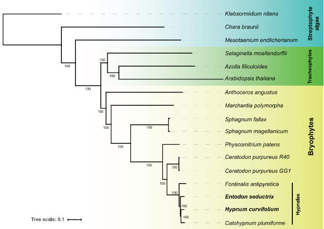
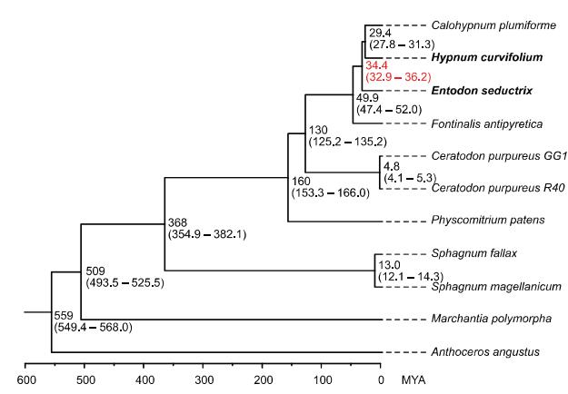
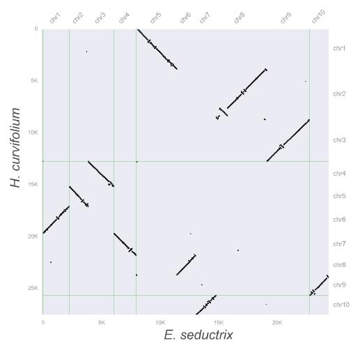
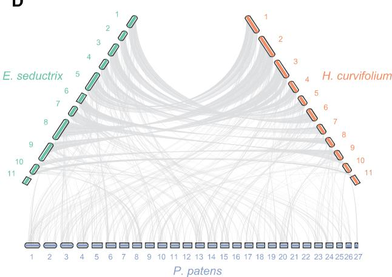
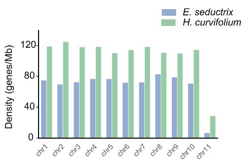
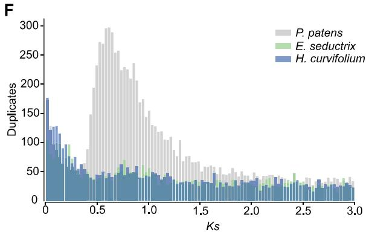

# Chromosome-Level Genome Assemblies of Two Hypnales (Mosses) Reveal High Intergeneric Synteny

Jin Yu $^{1,2,3}$ , Yuqing Cai $^{1,3}$ , Yixin Zhu $^{1,3}$ , Yuying Zeng $^{1,3}$ , Shanshan Dong $^{2}$ , Kexin Zhang $^{4}$ , Sibo Wang $^{3}$ , Linzhou Li $^{3}$ , Bernard Goffinet $^{5}$ , Huan Liu $^{3}$ , and Yang Liu $^{2,3,*}$

$^{1}$ College of Life Sciences, University of Chinese Academy of Sciences, Beijing, China

$^{2}$ Key Laboratory of Southern Subtropical Plant Diversity, Fairy Lake Botanical Garden, Shenzhen & Chinese Academy of Sciences, Shenzhen, Guangdong, China

$^{3}$ State Key Laboratory of Agricultural Genomics, BGI-Shenzhen, Shenzhen, China

$^{4}$ Department of Biology, Western University, London, Ontario, Canada

$^{5}$ Department of Ecology and Evolutionary Biology, University of Connecticut, USA

\*Corresponding author: E-mail: yang.liu0508@gmail.com.

Accepted: February 1, 2022

## Abstract

Mosses compose one of the three lineages of bryophytes. Today, about 13,000 species of mosses are recognized from across the globe, and at least one-third of this diversity composes the Hypnales, a lineage characterized by an early rapid radiation. We sequenced and de novo assembled the genomes of two hypnalean mosses, namely Entodon seductrix and Hypnum curvifolium, based on the 10x genomics and Hi-C data. The genome assemblies of E. seductrix and H. curvifolium comprise 348.4 and 262.0 Mb, respectively, estimated by k-mer analyses to represent 93.3% and 97.2% of their total genome size. Both genomes were assembled at the chromosome level, with scaffold N50 of 30.0 and 20.7 Mb, respectively. The annotated genome of E. seductrix comprises 25,801 protein-coding genes and that of H. curvifolium 29,077, estimated to represent 96.8% and 97.2%, respectively, of the total gene spaces based on BUSCO (Benchmarking Universal Single-Copy Ortholog) assessment. For both genomes, most contigs were anchored to the largest 11 pseudomolecules, corresponding to the 11 chromosomes of the two species, and each with a putative sex-related chromosome characterized by low gene density. The chromosomes of E. seductrix and H. curvifolium are highly syntenic, suggests limited architectural shifts occurred following the rapid radiation of the Hypnales. We compared their genomic features to the model moss Physcomitrium patens. The hypnalean moss genomes lack signatures of recent whole-genome duplication. The presented high-quality moss genomes provide new resources for comparative genomics to potentially unveil the genomic evolution of derived moss lineages.

Key words: genome, chromosome-level, moss, Entodon seductrix, Hypnum curvifolium.

## Significance

Over the past two decades, only a few bryophyte genomes have been published, of which only one is from Hypnales, the largest order of mosses. In this study, we generated chromosome-level genome assemblies from two hypnalean species, and identified significant intergeneric synteny between their chromosomes. The newly generated data should contribute to a better understanding of the genomic evolution of mosses and the rapid radiation of Hypnales.

## Introduction

Extant land plants consist of four major lineages: hornworts (Anthocerotophyta), liverworts (Marchantiophyta), mosses (Bryophyta), and vascular plants (Tracheophyta). The former three are collectively referred to as bryophytes, which were long considered to compose a paraphyletic group to vascular plants (Cox 2018), but are now increasingly viewed as sharing a unique common ancestor (Leebens-Mack et al. 2019). Given their life cycle dominated by the gametophytic generation, bryophytes likely retained many ancestral traits during the evolution of embryophytes, and are unique for the understanding of the early divergence of land plants. The transition from an aquatic to a terrestrial habitat, exposed the early land plants to dramatic changes in water availability, diurnal and seasonal temperatures, ultraviolet radiation exposure, etc. Bryophytes harbor key innovative attributes as a result of the adaptation to terrestrial environments, such as desiccation-tolerant spores and novel hormone signaling pathways (Bowman et al. 2017). Mosses are morphologically more complex than hornworts and liverworts, and with approximately 13,000 living species, mosses are the largest clade among the three lineages of bryophytes, and the second largest division of land plants after flowering plants (Goffinet and Shaw 2009). Among the 39 currently recognized moss orders, the Hypnales hold the most species, with approximately 4,000 species distributed among more than 40 families (Frey et al. 2009). The Hypnales belong to the pleurocarpous mosses, that is, Hypnanae, which are defined by strictly lateral and sessile female sex organs. Pleurocarpous mosses dominate the ground vegetation in boreal forests and epiphytic communities in temperate and tropical rainforests, and play critical roles in regulating nutrient fluxes and water movement in these ecosystems (Glime 2017).

Here we report the chromosome-level genome assemblies of two hypnalean mosses Entodon seductrix (Hedw.) Müll. Hal. (NCBI: txid105143) and Hypnum curvifolium Hedw. (NCBI: txid2029240), and compare their genomic features against those of the model moss Physcomitrium patens. These high-quality genomes should provide new insights into the genome evolution of mosses.

## Results and Discussion

## Genome Assembly

To acquire high-quality genome assemblies, we generated four types of data for both genomes, that is, the shotgun WGS, 10x linked-read, Hi-C, and transcriptome data (supplementary table S1, Supplementary Material online). The final genome assemblies of E. seductrix and H. curvifolium consist of 348.4 Mb (N50 = 30.0 Mb) and 262.0 Mb (N50 = 20.7 Mb), respectively (table 1), which are close to their k-mer based genome size estimate (i.e., 376.7 and 296.5 Mb). Our Hi-C analyses scaffolded

Table 1  
Statistics of Genome Assemblies that Newly Generated in This Study

<table><tr><td></td><td>Entodon seductrix</td><td>Hypnum curvifolium</td></tr><tr><td>Total length</td><td>348.4 Mb</td><td>262.0 Mb</td></tr><tr><td>Scaffold N50</td><td>30.0 Mb</td><td>20.7 Mb</td></tr><tr><td>Contig N50</td><td>188 kb</td><td>207 kb</td></tr><tr><td>Chromosome-level sequences</td><td>11</td><td>11</td></tr><tr><td>Total number of sequences</td><td>2,173</td><td>3,292</td></tr><tr><td>N bases percentage</td><td>0.67%</td><td>0.97%</td></tr><tr><td>BUSCO completeness</td><td>96.80%</td><td>97.20%</td></tr><tr><td>TE content</td><td>38.92%</td><td>38.99%</td></tr></table>

11 pseudomolecules for both species, anchoring 97.5% and 96.3% of the genome assemblies of E. seductrix and H. curvifolium, respectively, and corresponding to the 11 chromosomes (n = 11) of both species' karyotypes (Fritsch 1991). Our assemblies are comparable in quality to those of the model moss Physcomitrium patens v3.1 (Lang et al. 2018), which are based on a scaffold N50 of 17.4 Mb for a 473-Mb genome. Based on the Benchmarking Universal Single-Copy Ortholog (BUSCO) assessment v3.1.0 (Simão et al. 2015) using the Viridiplantae odb10 data set the completeness of gene space sampling of the E. seductrix and H. curvifolium genomes is estimated at of 96.8% and 97.5%, respectively (supplementary fig. S2, Supplementary Material online).

## Characteristics of the Moss Genomes

Repetitive elements compose 39.81% and 39.83% of the genomes of E. seductrix and H. curvifolium, respectively. For both genomes, the major portion of repetitive elements were unclassified, accounting for 28.86% and 24.99% of the E. seductrix and H. curvifolium genomes, respectively, followed by LTR retrotransposons (accounting for 9.10% and 12.96% of the genome contents), which were dominated by Gypsy-type elements (54% and 37% of the total LTR of E. seductrix and H. curvifolium, respectively). A total of 25,801 and 29,077 protein-coding genes were respectively annotated for E. seductrix and H. curvifolium, of which 87.32% and 81.53% have mRNA-seq or homolog protein supports (supplementary table S2, Supplementary Material online).

## Phylogenetic Reconstruction and Divergence Time Estimation

Our phylogenetic reconstruction resolves the hornwort, liverwort, and mosses forming a clade sister to vascular plants, with liverworts and mosses forming a sister clade to hornworts. Within mosses, the newly sequenced E. seductrix and H. curvifolium compose along with Fontinalis antipyretica and the recently published moss Calohypnum plumiforme (formerly known as Hypnum plumiforme) (Mao et al. 2020) the Hypnales (fig. 1A). Divergence time estimation suggests that the split between the clade consisting of H. curvifolium and Calohypnum plumiforme and E. seductrix occurred at around 32.9–36.2 Ma (fig. 1B).

A  
  
B

C  

D  

E  

  
FIG. 1.—(A) A phylogenetic tree inferred with single-copy nuclear genes of 17 green plant genomes. The two newly sequenced mosses are in bold. Numbers on branches indicate bootstrap support values. (B) A result of molecular dating analysis (with outgroups removed) showing the divergence time among bryophyte lineages. Divergence time involving the newly sequenced two mosses is in red. (C) Synteny between the newly sequenced two moss genomes. The numbers on the axes indicate the number of genes examined. The putative sex chromosomes of both species were not shown due to they possess too few genes (i.e., 104 on Entodon seductrix and 433 on Hypnum curvifolium). (D) Syntenies among genomes of the two newly sequenced mosses and the model moss Physcomitrium patens. (E) Gene density histograms of E. seductrix and H. curvifolium chromosomes. Each genome has a low gene-density chromosome (chr11), assumed to be the sex-related chromosomes. (F) Ks distribution of E. seductrix, H. curvifolium and the model moss P. patens genomes, indicating the newly sequenced moss genomes harbor no evident WGD event, whereas P. patens genome shows at least one WGD.

## Synteny among Selected Moss Genomes

Significant colinearity was observed between the chromosomes of E. seductrix and H. curvifolium (fig. 1C), and unexpectedly, a surprising degree of synteny between P. patens and E. seductrix/H. curvifolium (fig. 1D and supplementary figs. S3 and S4, Supplementary Material online) was also seen, considering P. patens is distantly related to the hypnalean mosses and the divergence of them dates back to about 160 Ma (fig. 1B). By contrast, genomes of angiosperms, even among close relatives, usually show low levels of synteny (Salse et al. 2002; Tang et al. 2008), and syntenies between moss and liverwort genomes, or moss and hornwort genomes are also rare (supplementary fig. S5, Supplementary Material online). The highly syntenic feature between the E. seductrix and H. curvifolium chromosomes is consistent with their high similarities of genomes, and may reflect their recent divergence, through the rapid early radiation of the Hypnales (Shaw et al. 2003). Whether large synteny is indeed preserved across Hypnales cannot yet be tested further as no chromosome-scale assemblies are available for either Fontinalis (Yu et al. 2020) or Calohypnum (Mao et al. 2020).

## Low Gene Density of Putative Sex Chromosomes

In general, genes are evenly distributed across ten pseudochromosomes of both the Entodon and Hypnum genomes, whereas in their 11th chromosome, here considered as putative sex-related chromosomes, gene density is comparatively much lower (fig. 1E). Our Hi-C results also indicated that few contacts exist between these two and other chromosomes, whereas significantly high contacts among other chromosomes were observed in both genomes (supplementary figs. S6 and S7, Supplementary Material online). The putative sex-related chromosomes span 16.4 and 15.3 Mb and harbor 103 and 433 genes in E. seductrix and H. curvifolium, respectively. Compared with autosomes, the putative sex chromosomes have higher repeat contents (i.e., 58.53% vs. 39.11% in E. seductrix, and 82.77% vs. 37.78% in Hypnum curvifolium), a phenomenon that was also observed in other moss genomes (i.e., Ceratodon purpureus and Syntrichia caninervis) (Carey et al. 2021; Silva et al. 2021).

We further examined the gene densities of the genomes of the model moss P. patens (Lang et al. 2018) and the model liverwort Marchantia polymorpha (Bowman et al. 2017). In P. patens, the gene density among the 27 chromosomes is relatively even, consistent with the monoicous P. patens lacking heteromorphic sex chromosomes. By contrast, the two sex chromosomes (U and V) of the dioicous Marchantia have lower gene densities, like in our sequenced two hypnalean mosses (supplementary fig. S8A and B,

Supplementary Material online) (Bowman et al. 2017). Similarly, in the recently published moss genome of Ceratodon purpureus, both the U and V sex chromosomes also harbor lower gene densities than autosomes (supplementary fig. S8C, Supplementary Material online) (Carey et al. 2021), a pattern that may be widespread or universal in bryophytes with sex chromosomes.

## Whole-Genome Duplication

To investigate whether whole-genome duplication (WGD) events shaped the evolution of the two studied moss genomes, we calculated the distribution of the number of synonymous substitutions per synonymous site (Ks) and visualized the results. Our analysis suggested that the newly sequenced moss genomes harbor no signatures of a recent WGD, compared with two in P. patens (fig. 1F), which is consistent with the findings of a recent transcriptomic study (Gao et al. 2022).

## Conclusions

In this study, we sequenced, and de novo assembled the genomes of two hypnalean moss species. We analyzed their genomic features, and reconstructed their close phylogenetic relationship and short divergence time. We revealed the high synteny between their chromosomes, the low gene density and high repeat content of their putative sex chromosomes, and the absence of recent WGD event during their recent evolution. The high-quality chromosome-level genomes provided new resources for studying the evolution of bryophyte genomes and the conspicuous diversification of pleurocarpous mosses.

## Materials and Methods

## Sample Collection

Wild gametophytes of both E. seductrix and H. curvifolium were collected in Connecticut. For each species we sampled green foliated stems and branches and removed debris and soil particles. The voucher specimens (collection number: Goffinet 14196 and 14195) have been deposited in the George Safford Torrey Herbarium at the University of Connecticut (CONN). The genomic DNA was extracted at the Fairy Lake Botanical Garden, and deposited with DNA extraction numbers of 330 for H. curvifolium and 331 for E. seductrix.

## Library Preparation and Genome Sequencing

WGS libraries were prepared by BGI-Shenzhen with insert sizes of 300–500 bp. The high-molecular weight genomic DNA was used to construct the 10x Genomic libraries with insert sizes of 350–500 bp following the manufacturer's protocol (Chromium Genome Chip Kit v1, PN-120229, 10x Genomics, Pleasanton). Hi-C libraries were prepared by BGI-

Qingdao, and the main steps of Hi-C library construction process include cross-linking, digestion with restricted enzyme (MboI), end repairing, DNA cyclization, and purification. Gametophyte tissues were used for RNA extraction and sequencing for both species. All the sequences were generated by the BGISEQ-500 sequencing platform (BGI-Shenzhen, China).

## Genome Size Estimation

We performed k-mer analyses to estimate the genome sizes of E. seductrix and H. curvifolium using WGS reads. Kmerfreq (Liu et al. 2013) v1.0 was used to calculate k-mer distributions with default parameters. Genome size was estimated by dividing total k-mer numbers by the k-mer peak depth. We estimated the genomes of E. seductrix and H. curvifolium to hold 376.7 and 269.5 Mb, respectively.

## Genome Assembly and Hi-C Scaffolding

The de novo assembly of both genomes was carried out by Supernova v2.1.1 (Weisenfeld et al. 2017) provided by 10x Genomics using default parameters. The Hi-C raw reads were first processed by Trimmomatic v0.39 (Bolger et al. 2014) to remove adapter sequences and low-quality regions. Juicer v1.6 (Durand et al. 2016) was then used to extract valid data from quality-controlled reads. We then used the 3D-DNA pipeline (Dudchenko et al. 2017) to correct misassembles, anchor, order, and orient assembled contigs based on the Hi-C data.

## Contamination Removal

To remove contaminating reads, we first performed NCBI BLAST (Basic Local Alignment Search Tool) (Camacho et al. 2009) search for the scaffolded sequences with e-value threshold of $10^{-5}$ . The NCBI's nucleotide collection and non-redundant protein sequences (nt/nr, released in May 2020) were used as the BLAST reference databases. In-house Perl scripts were used to assign taxonomic affiliations to each high scoring pair of all query-subject pairs. Sequences identified as non-Viridiplantae origin were removed from the genome assemblies. To verify the result of decontamination procedure, we performed GC-depth analysis with a window size of 10 kb (supplementary fig. S9, Supplementary Material online).

## Annotation of Repeats and Genes

Repetitive elements were identified by building a custom repeat library and screening with curated repeat libraries. Piler (Edgar and Myers 2005), LTR\_FINDER (Xu and Wang 2007), and RepeatScout (Price et al. 2005) were used for creating a custom repeat library, which was then used by RepeatMasker (Chen 2004) for de novo repeat identification. RepeatMasker also makes use of Repbase v21.01 (Jurka et al. 2005) which is based on known repetitive elements. For gene structure annotation, BRAKER v2.1.5 (Brûna et al. 2021) pipeline was used after soft-masking of the genome. Transcriptome sequencing reads were mapped to the genomes by TopHat2 v2.1.1 (Kim et al. 2013) to provide EST evidences. Proteome sequences of six green plants (i.e., Arabidopsis thaliana, Azolla filiculoides, Marchantia polymorpha, P. patens, Salvinia cucullata, and Selaginella moellendorffii) that retrieved from the Phytozome v13 database (https://phytozome-next.jgi.doe.gov/, last accessed February 11, 2022) were used as the homology-based evidences.

## Functional Annotation of Gene Sets

For gene functional annotation, the annotated protein sequences were first aligned against the KEGG (https://www.genome.jp/kegg/, last accessed February 11, 2022) and Swissprot (https://www.uniprot.org/, last accessed February 11, 2022) databases by BlastP (Camacho et al. 2009) with an e-value of $1\mathrm{e}^{-5}$ and then assigned functional annotations. We also used InterproScan v5.51-85.0 (Jones et al. 2014) to annotate the protein sequences.

## Estimation for Synteny

To explore synteny between the E. seductrix and H. curvifolium genomes, as well as with that of the model moss P. patens, we used the python library jCVi v1.1.8 (Tang et al. 2008) to search for colinear blocks among these moss genomes.

## Phylogenetic Reconstruction and Divergence Time Estimation

The two newly sequenced moss genomes and the other 15 green plant genomes (see supplementary table S3, Supplementary Material online) were used for phylogenetic tree reconstruction. Gene family clustering was performed by OrthoFinder v2.3.7 (Emms and Kelly 2015) with default parameters. These single-copy nuclear genes were aligned separately by MAFFT v7.453 (Katoh and Standley 2013) and concatenated into one data matrix. RAxML v8.2.12 (Stamatakis 2014) was then used to infer the phylogenetic tree using maximum likelihood method with the PROTCATGTR substitution model.

We used BEAST2 v2.6.4 (Bouckaert et al. 2014) to estimate the divergence time between the selected species. The following fossil calibrations, that is, the split of algae and land plants at approximately 1,050 Ma, split of bryophytes and vascular plants at 471–515 Ma, split of ferns and seed plants at approximately 385–451 Ma, and split of liverworts and mosses at approximately 407–515 Ma, were used as priors.

## Supplementary Material

Supplementary data are available at Genome Biology and Evolution online.

## Acknowledgments

The study was funded by the National Natural Science Foundation of China (NSFC-31470314) and Shenzhen Municipal Government of China (No. JCYJ2015 1015162041454 to HL). The authors thank Wei Sheng and Na Li (Shenzhen Fairy Lake Botanical Garden) for laboratory assistance, and Zachary Muscavitch (University of Connecticut) for photographing the specimens. This work was supported by the 10KP project (https://db.cngb.org/10kp/, last accessed February 11, 2022) and the China National GeneBank (CNGB; https://www.cngb.org/, last accessed February 11, 2022).

## Author Contributions

Y.L., H.L., and B.G. conceived the project; B.G. collected, identified, and photographed the specimens; J.Y. performed the DNA extraction, library preparation, and sequencing; J.Y. assembled the genomes; J.Y., Y.C., Y.Z., Y.Z., K.Z., S.W., and L.L. analyzed the genomes; S.D. contributed the phylogenomic analysis; J.Y. led the writing of the manuscript; Y.L. and B.G. revised the manuscript. All authors read and approved the final manuscript for submission.

## Data Availability

The raw reads have been deposited in CNSA (https://db.cngb.org/cnsa/, last accessed February 11, 2022) under project CNP0002064. The assembled genomes have been deposited under accessions CNA0030130 and CNA0030131. Genome annotation files have been deposited at the figshare data repository (doi: 10.6084/m9.figshare.17097077).

## Literature Cited

Bouckaert R, et al. 2014. BEAST 2: a software platform for Bayesian evolutionary analysis. PLoS Comput Biol. 10(4):e1003537.

Bowman JL, et al. 2017. Insights into land plant evolution garnered from the Marchantia polymorpha genome. Cell 171:287–304.e215.

Biúna T, Hoff KJ, Lomsadze A, Stanke M, Borodovsky M. 2021. BRAKER2: automatic eukaryotic genome annotation with GeneMark-EP+ and AUGUSTUS supported by a protein database. NAR Genomics Bioinformatics 3(1):Iqaa108.

Camacho C, et al. 2009. BLAST+: architecture and applications. BMC Bioinformatics 10(1):19.

Carey SB, et al. 2021. Gene-rich UV sex chromosomes harbor conserved regulators of sexual development. Sci Adv. 7(27):eabh2488.

Chen N. 2004. Using Repeat Masker to identify repetitive elements in genomic sequences. Curr Protoc Bioinformatics. 5(1):4.10.1–14.10.14.

Cox CJ. 2018. Land plant molecular phylogenetics: a review with comments on evaluating incongruence among phylogenies. Crit Rev Plant Sci. 37(2–3):113–127.

Dudchenko O, et al. 2017. De novo assembly of the Aedes aegypti genome using Hi-C yields chromosome-length scaffolds. Science 356(6333):92–95.

Durand NC, et al. 2016. Juicer provides a one-click system for analyzing loop-resolution Hi-C experiments. Cell Syst. 3(1):95–98.

Edgar RC, Myers EW. 2005. PILER: identification and classification of genomic repeats. Bioinformatics 21(Suppl 1):i152–i158.

Emms DM, Kelly S. 2015. OrthoFinder: solving fundamental biases in whole genome comparisons dramatically improves orthogroup inference accuracy. Genome Biol. 16(1):14.

Frey W, Fischer E, Stech M. 2009. Bryophytes and seedless vascular plants. In: Frey W, editor. Syllabus of Plant Families—A. Engler's Syllabus der Pflanzenfamilien. Berlin/Stuttgart: Borntraeger, Auflage.

Fritsch R. 1991. Index to bryophyte chromosome counts. Berlin: J. Cramer. Gao B, et al. 2022. Ancestral gene duplications in mosses characterized by integrated phylogenomic analyses. J Syst Evol. 60(1):144–159.

Glime JM, editor. 2017. Nutrient relationships: Cycling. Chapt. 8-8. In: Bryophyte Ecology. Vol. 1. Physiological 8-8-1 Ecology. Ebook. Available from: http://digitalcommons.mtu.edu/bryophyte-ecology.

Goffinet B, Shaw AJ. 2009. Bryophyte Biology. Cambridge (United Kingdom): Cambridge University Press.

Jones P, et al. 2014. InterProScan 5: genome-scale protein function classification. Bioinformatics 30(9):1236–1240.

Jurka J, et al. 2005. Repbase Update, a database of eukaryotic repetitive elements. Cytogenet Genome Res. 110(1–4):462–467.

Katoh K, Standley DM. 2013. MAFFT multiple sequence alignment software version 7: improvements in performance and usability. Mol Biol Evol. 30(4):772–780.

Kim D, et al. 2013. TopHat2: accurate alignment of transcriptomes in the presence of insertions, deletions and gene fusions. Genome Biol. 14(4):1–13.

Lang D, et al. 2018. The Physcomitrella patens chromosome-scale assembly reveals moss genome structure and evolution. Plant J. 93(3):515–533.

Leebens-Mack JH, et al. 2019. One thousand plant transcriptomes and the phylogenomics of green plants. Nature 574:679–685.

Liu B, et al. 2013. Estimation of genomic characteristics by analyzing k-mer frequency in de novo genome projects. arXiv preprint arXiv:1308.2012. Available from: https://arxiv.org/abs/1308:2012. Accessed February 14, 2022.

Mao L, et al. 2020. Genomic evidence for convergent evolution of gene clusters for momilactone biosynthesis in land plants. Proc Natl Acad Sci U S A. 117(22):12472–12480.

Price AL, Jones NC, Pevzner PA. 2005. De novo identification of repeat families in large genomes. Bioinformatics 21(Suppl 1):i351–i358.

Salse J, Piegu B, Cooke R, Delseny M. 2002. Synteny between Arabidopsis thaliana and rice at the genome level: a tool to identify conservation in the ongoing rice genome sequencing project. Nucleic Acids Res. 30(11):2316–2328.

Shaw A, Cox C, Goffinet B, Buck W, Boles S. 2003. Phylogenetic evidence of a rapid radiation of pleurocarpous mosses (Bryophyta). Evolution 57(10):2226–2241.

Silva AT, et al. 2021. To dry perchance to live: insights from the genome of the desiccation-tolerant biocrust moss Syntrichia caninervis. Plant J. 105(5):1339–1356.

Simão FA, Waterhouse RM, Ioannidis P, Kriventseva EV, Zdobnov EM. 2015. BUSCO: assessing genome assembly and annotation completeness with single-copy orthologs. Bioinformatics 31(19):3210–3212.

Stamatakis A. 2014. RAxML version 8: a tool for phylogenetic analysis and post-analysis of large phylogenies. Bioinformatics 30(9):1312–1313.

Tang H, et al. 2008. Synteny and collinearity in plant genomes. Science 320(5875):486–488.

Weisenfeld NI, Kumar V, Shah P, Church DM, Jaffe DB. 2017. Direct determination of diploid genome sequences. Genome Res. 27(5):757–767.

Xu Z, Wang H. 2007. LTR\_FINDER: an efficient tool for the prediction of full-length LTR retrotransposons. Nucleic Acids Res. 35(Web Server issue):W265–W268.

Yu J, et al. 2020. Draft genome of the aquatic moss Fontinalis antipyretica (Fontinalaceae, Bryophyta). Gigabyte 2020:1–9.
Associate editor: Maud Tenaillon