Check for updates

# An ancestral signalling pathway is conserved in intracellular symbioses-forming plant lineages

Guru V. Radhakrishnan  1,12, Jean Keller  2,12, Melanie K. Rich2,12, Tatiana Vernié  2,12, Duchesse L. Mbadinga Mbadinga2, Nicolas Vigneron2, Ludovic Cottret3, Hélène San Clemente  2, Cyril Libourel  2, Jitender Cheema1, Anna-Malin Linde4, D. Magnus Eklund  4, Shifeng Cheng5, Gane K. S. Wong  6,7,8, Ulf Lagercrantz4, Fay-Wei Li  9,10, Giles E. D. Oldroyd  1,11 ✉ and Pierre-Marc Delaux  2 ✉

Plants are the foundation of terrestrial ecosystems, and their colonization of land was probably facilitated by mutualistic associations with arbuscular mycorrhizal fungi. Following this founding event, plant diversification has led to the emergence of a tremendous diversity of mutualistic symbioses with microorganisms, ranging from extracellular associations to the most intimate intracellular associations, where fungal or bacterial symbionts are hosted inside plant cells. Here, through analysis of 271 transcriptomes and 116 plant genomes spanning the entire land-plant diversity, we demonstrate that a common symbiosis signalling pathway co-evolved with intracellular endosymbioses, from the ancestral arbuscular mycorrhiza to the more recent ericoid and orchid mycorrhizae in angiosperms and ericoid-like associations of bryophytes. By contrast, species forming exclusively extracellular symbioses, such as ectomycorrhizae, and those forming associations with cyanobacteria, have lost this signalling pathway. This work unifies intracellular symbioses, revealing conservation in their evolution across 450 million yr of plant diversification.

Since they colonized land 450 million yr ago, plants have beenthe foundation of most terrestrial ecosystems1. Such success- the foundation of most terrestrial ecosystems¹. Such successful colonization occurred only once in the plant kingdom, and it has been proposed that the symbiotic association formed with arbuscular mycorrhizal fungi supported that transition2,3. Following this founding event, plant diversification was accompanied by the emergence of alternative or additional symbionts4. Among alternative symbioses, the association between orchids and Ericales with both ascomycetes and basidiomycetes are two endosymbioses with specific intracellular structures in two plant lineages that lost the ability to form arbuscular mycorrhizal symbiosis (AMS)5. Orchid mycorrhiza and ericoid mycorrhiza represent two clear symbiosis switches, in which intracellular associations are sustained, but the nature of the symbionts are radically different. Similarly, within the liverworts, the Jungermanniales engage in ericoid-like endosymbioses but not AMS, and represent another symbiont switch that occurred during plant evolution6. Other symbioses can occur simultaneously with AMS; for example, root-nodule symbiosis, an association with nitrogen-fixing bacteria that evolved in the last common ancestor of Fabales, Fagales, Cucurbitales and Rosales7. Another example is ectomycorrhizae, an extracellular symbiosis found in several gymnosperm and angiosperm lineages—in some lineages both AMS and ectomycorrhizae have been retained, whereas other lineages have switched from AMS to ectomycorrhizae8. Finally, associations with cyanobacteria, which occur only in the intercellular spaces of the plant tissue, can be found in diverse species among the embryophytes, including hornworts, liverworts, ferns, gymnosperms and angiosperms9. Despite the improved nutrient acquisition afforded to plants by these different types of mutualistic symbioses, entire plant lineages have completely lost the symbiotic state, a phenomenon known as mutualism abandonment4.

Our understanding of the molecular mechanisms governing the establishment and function of these symbioses comes from forward and reverse genetics conducted in legumes and a few other angio sperms¹⁰, and is restricted to AMS and root-nodule symbiosis7,11 These detailed studies in selected plant species have enabled phy logenetic analyses to more precisely link the symbiotic genes with either AMS or root-nodule symbiosis. Indeed, the loss of AMS or root-nodule symbiosis correlates with the loss of many genes that are known to be involved in these associations7,11. The gene losses are thought to be the result of a relaxed selection pressure following loss of the trait, resulting in co-elimination, which specifically targets only genes required for the lost trait12. Co-elimination can be tracked at the genome-wide level using comparative phylogenomic approaches on species with contrasting retention of the trait of interest13,14. Such approaches have led, for instance, to the discovery of genes associated with small RNA biosynthesis and signalling1 or cilia function15. Applied to AMS, comparative phylogenomics in angiosperms identified a set of more than 100 genes that were lost in a convergent manner in lineages that lost the AMS16–18.

Table 1 | Genome assembly statistics for Marchantia species sequenced as part of this study and comparison with the M. polymorpha ssp. ruderalis TAK1 reference genome

<table><tr><td colspan="2"></td><td>M. polymorpha ssp. ruderalis TAK1</td><td>M. paleacea</td><td>M. polymorpha ssp. polymorpha</td><td>M. polymorpha ssp. montivagans</td></tr><tr><td colspan="2">Assembly size (Mb)</td><td>210.6</td><td>238.61</td><td>222.7</td><td>225.7</td></tr><tr><td colspan="2">Scaffolds</td><td>2,957</td><td>22,669</td><td>2,741</td><td>2,710</td></tr><tr><td colspan="2">N50 length (kb)</td><td>1,313.57</td><td>77.78</td><td>368.25</td><td>589.42</td></tr><tr><td rowspan="5">BUSCO score</td><td>Complete</td><td>821</td><td>817</td><td>855</td><td>855</td></tr><tr><td>Single copy</td><td>793</td><td>790</td><td>832</td><td>829</td></tr><tr><td>Duplicated</td><td>28</td><td>27</td><td>23</td><td>26</td></tr><tr><td>Fragmented</td><td>48</td><td>53</td><td>38</td><td>42</td></tr><tr><td>Missing</td><td>571</td><td>570</td><td>547</td><td>543</td></tr><tr><td colspan="2">GC content (%)</td><td>41.1</td><td>40.3</td><td>42.2</td><td>42.1</td></tr><tr><td colspan="2">Reference</td><td>Bowman et al. $^{26}$ </td><td>This study</td><td>This study</td><td>This study</td></tr></table>

Mb, megabases; kb, kilobases.

All classes of functions essential for AMS were detected among these genes, including the initial signalling pathway—essential for the host plant to activate its symbiotic program—and genes involved in the transfer of lipids from the host plant to the arbuscular mycorrhizal fungi. Since their identification by phylogenomics, novel candidates were validated for their involvement in AMS through reverse genetic analyses in legumes19–21.

Targeted phylogenetic analyses have identified multiple symbiotic genes in the transcriptomes of bryophytes, but study of the overall molecular conservation of symbiotic mechanisms in land plants are lacking22–24. Similarly, the plant molecular mechanisms behind the diverse array of mutualistic associations, either intracellular or extracellular, are poorly understood10. In this study, we demonstrate through analysis of a comprehensive set of plant genomes and transcriptomes, the loss and conservation of symbiotic genes associated with the evolution of diverse mutualistic symbioses in plants.

## Results

A database covering the diversity of plant lineages and symbi otic associations. Genomic and transcriptomic data are scattered between public repositories, specialized databases and personal websites. To facilitate large-scale phylogenetic analysis, we compiled resources for species covering the broad diversity of plants and symbiotic status in a centralized database, SymDB (www.polebio.lrsv. ups-tlse.fr/symdb/). This sampling of available resources covers lineages forming most of the known mutualistic associations in plants (Supplementary Table 1), including AMS, root-nodule symbiosis, ectomycorrhizae, orchid mycorrhiza, cyanobacterial associations in hornworts and ferns, and ericoid-like symbioses in liverworts. SymDB also includes genomes of lineages that have abandoned mutualism in the angiosperms, gymnosperms, monilophytes and bryophytes. To enrich this sampling, we generated two additional datasets: an in depth transcriptome of the liverwort Blasia pusilla, which associates with cyanobacteria, and—since no genome of an arbuscular mycorrhizal host was available for the bryophytes—we sequenced the genome of the complex thalloid liverwort Marchantia paleacea de novo, which specifically associates with arbuscular mycorrhizal fungi25. The obtained assembly was of similar size and completeness to the Marchantia polymorpha TAK1 genome26 (Table 1). These new datasets augmented the SymDB database, encompassing a total of 116 genomes and 271 transcriptomes, providing broad coverage of mutualistic symbioses in plants.

Mutualism abandonment leads to gene loss, positive selection or pseudogenization of symbiosis genes. Previous studies have demonstrated that loss of AMS in six angiosperm lineages is associated with the convergent loss of many genes16,17. SymDB contains species from across the entire land-plant lineage that have lost AMS, and thus provided us with a platform to assess co-elimination of genes associated with the abandonment of mutualism throughout the plant kingdom. We generated phylogenetic trees for all the genes previously identified as being lost in angiosperms with loss of AMS (Supplementary Figs. 1–32 and Supplementary Table 2). Among these gene phylogenies, those missing from the largest number of lineages that have abandoned mutualism were selected. Six genes, SymRK, CCaMK, CYCLOPS, the GRAS transcription factor RAD1 and two half-ATP-binding cassette (ABC) transport ers—STR and STR2—were consistently lost in non-mutualistic lin eages in angiosperms, gymnosperms, ferns and Bryophytes (Fig. 1 and Supplementary Figs. 1, 3 and 13–15). Very few exceptions to this trend were found (Fig. 1 and Supplementary Figs. 13 and 14), for instance, the presence of CCaMK in the aquatic angiosperm Nelumbo nucifera, which was previously reported in Bravo et  al.16. However, further analysis of this locus revealed a deletion in the kinase domain leading to a probably non-functional pseudogene (Supplementary Fig. 33). The same deletion was present in two different ecotypes and three independent genome assemblies (Supplementary Fig. 33). The second consequential exception was in mosses, where CCaMK and CYCLOPS were present despite the documented loss of AMS in this lineage (Fig. 1 and Supplementary Figs. 13 and 14). Previously, it was proposed that the selective pressure acting on both genes was relaxed in the branch following the divergence of the only mycorrhizae-forming moss (Takakia) and other moss species24. Using two independent approaches (RELAX and PAML) we confirmed this initial result and identified sites under positive selection (Supplementary Figs. 34 and 35 and Supplementary Table 3), suggesting the neofunctionalization of these two genes. From our analysis, we also detected in three species that are thought to be non-mutualistic the presence of STR2 (in a single fern species) and RAD1 (in two liverworts) (Fig. 2b,c). The presence of these genes may reflect additional cases of speciesspecific neofunctionalization or may be the result of misassignment of the symbiotic state27.

Among the species that have abandoned mutualism, M. poly morpha is a particularly intriguing case, since the non-mutualistic M. polymorpha and the mutualistic M. paleacea belong to recently diverged lineages28. M. polymorpha represents the most recent loss of mutualism of which we are aware, and therefore this species may enable us to witness the process of co-elimination of sym biosis genes with the loss of mutualism. For this reason, we chose

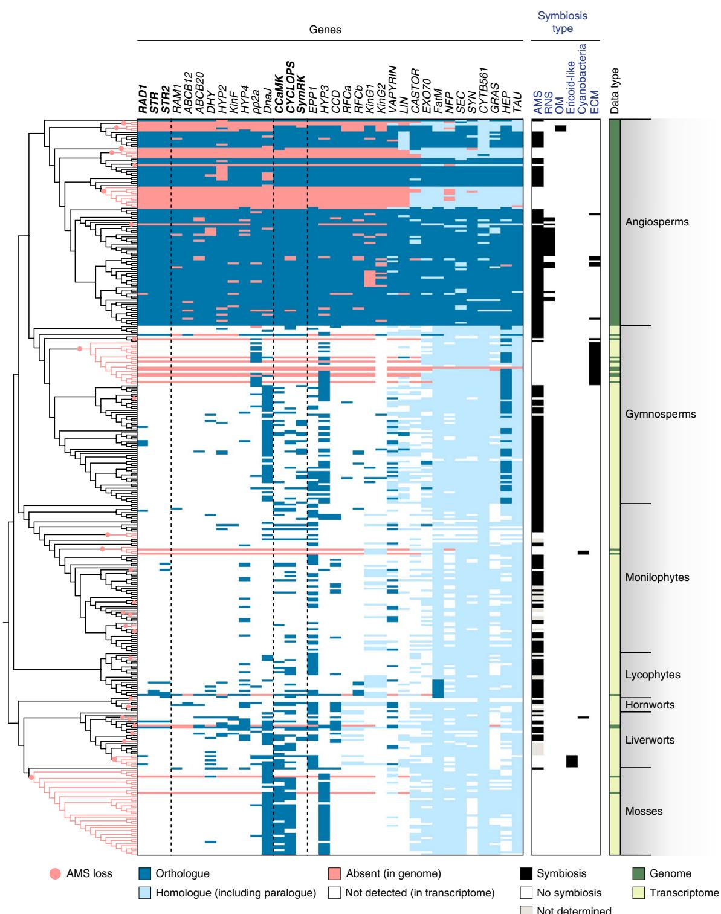  
Fig. 1 | Conservation of the symbiotic genes in land plants. The tree on the left depicts the theoretical plant phylogeny. The heat map indicates the phylogenetic pattern for each of the 34 investigated genes. The type of symbiosis formed by each investigated species is indicated by black boxes. Genes in bold co-evolved with AMS (RAD1, STR and STR2) or with every type of intracellular symbiosis (CCaMK, CYCLOPS and SymRK). RNS, root-nodule symbiosis; OM, orchid mycorrhiza; cyanobacteria, association with cyanobacteria; EcM, ectomycorrhizae.

to sequence the genome of the symbiotic M. paleacea to allow a detailed comparison between symbiotic and non-symbiotic liverwort species. Using microsynteny, we identified potential remnants of symbiotic genes in M. polymorpha ssp. ruderalis TAK1, pseudogenes for SymRK, CCaMK, CYCLOPS and RAD1 existed in genomic blocks syntenic with M. paleacea, while STR and STR2 were completely absent (Fig. 3). These pseudogenes have accumulated point mutations, deletions and insertions (Fig. 3), and their presence supports a recent abandonment of mutualism in M. polymorpha. To better estimate the timing of this abandonment, we collected 35 M. polymorpha ssp. ruderalis accessions in Europe (Supplementary Table 4) and sequenced CYCLOPS and CCaMK. All accessions harboured pseudogenes at these two loci, confirming the fixation of these null alleles in the subspecies ruderalis (Fig. 3 and Supplementary Fig. 36). Besides M. polymorpha ssp. ruderalis, two other M. polymorpha subspecies have been reported—ssp. polymorpha and ssp. montivagans—that are sister to M. paleacea. We phenotyped these two subspecies in controlled conditions and confirmed that the loss of AMS occurred before the radiation of the three M. polymorpha subspecies approximately 5 million yr ago28 (Fig. 3). We sequenced high-quality genomes of M. polymorpha ssp. montivagans and polymorpha and searched for the presence of the six aforementioned genes. As for M. polymorpha ssp. ruderalis, all six genes were pseudogenized or missing in these two novel assemblies (Fig. 3). As expected for genes under relaxed selection pressure, the signatures of pseudogenization were different between the three subspecies (Fig. 3).

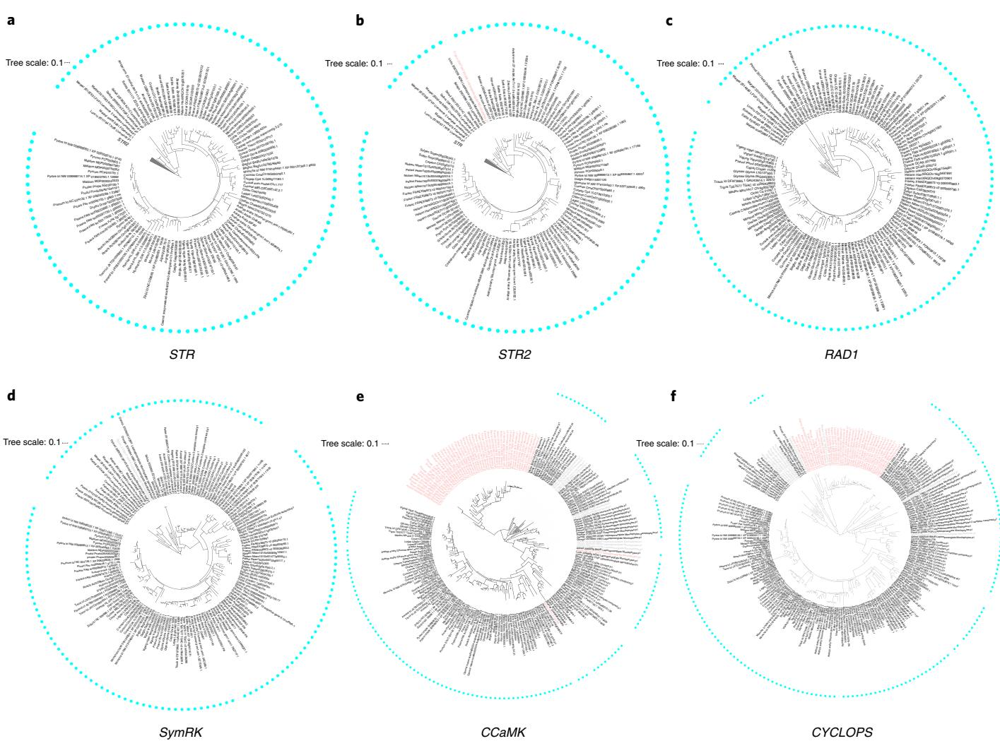  
Fig. 2 | Maximum-likelihood trees of genes specific to the AMS or intracellular symbioses in land plants. a–c, AMS: STR (sequence substitution mode indicated for each phylogenetic analysis (model): TVMe + R5) (a), STR2 (model: SYM + R6) (b) and RAD1 (model: TVMe + R5) (c). d–f, Intracellular symbioses: SymRK (model: GTR + F + R5) (d), CCaMK (SYM + R6) (e) and CYCLOPS (GTR + F + R5) (f). STR and STR2 trees were rooted using their closest paralogues STR2 and STR, respectively. The RAD1 tree was rooted on the bryophyte clade. SymRK, CCaMK and CYCLOPS trees were rooted on the bryophyte clade. Species names are coloured as follows: black, species with intracellular symbiosis; light red, species without intracellular infection; light grey, species with undetermined symbiotic status. Cyan dots indicate species with AMS. High-resolution phylogenetic trees are available as Supplementary Figs. 1, 3 and 13–15.

We conclude that mutualism abandonment leads to the consistent loss, pseudogenization or relaxed selection pressure of at least six symbiosis-specific genes in all surveyed land-plant lineages.

Genes specific to AMS in land plants. We have shown consistent loss of six genes with mutualism abandonment, but with the broader array of genomes present, we are now able to test whether these genes are lost with mutualism abandonment generally, or specifically with the loss of AMS. Three genes, RAD1, STR and STR2, show a phylogenetic pattern consistent with gene loss specifically associated with the loss of AMS (Fig. 2). Our dataset covers at least 29 convergent losses of AMS, thus representing many independent replications of AMS loss in vascular plants and in bryophytes. We therefore conclude that RAD1, STR and STR2 were specific to AMS in the most recent common ancestor of all land plants. The fact that all three genes are absent from non-AM-host lineages indicates a particularly efficient co-elimination of these genes following the loss of AMS, suggesting possible selection against these genes4,17,27. We suggest that one potential driver for the loss of AMS is the adap tation to nutrient-rich ecological niches, which are known to inhibit the formation of AMS29 and thus render the symbiosis redundant. Alternatively, selection against these genes may be driven by the hijacking of the AMS-related pathway by pathogens that would result in positive selection acting against this pathway in the presence of a high pathogen pressure. Although this question is not settled yet, the example of RAD1, which has been demonstrated to act as a susceptibility factor to the oomycete pathogen Phytophthora palmivora in Medicago truncatula30, provides support for this second hypothesis. RAD1 encodes a transcription factor in the GRAS family and rad1 mutants display reduced colonization by arbuscular mycorrhizal fungi, defective arbuscules—the interface for nutrient exchange formed by both partners inside the plant cells—and STR STR219,31 transporters are present on the peri-arbuscular membrane, are essential for functional AMS, and have been proposed to be involved in the transfer of lipids from the host plant to arbuscular mycorrhizal fungi20,21,32,33. The specialization of RAD1, STR and STR2 to AMS in all plant lineages analysed supports an ancient ancestral origin in land plants for symbiotic lipid transfer to AMS.

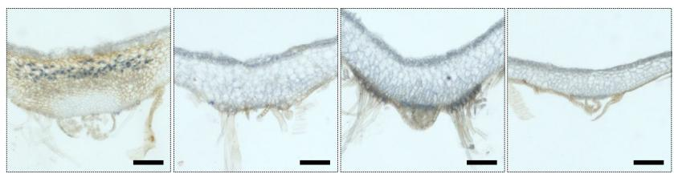

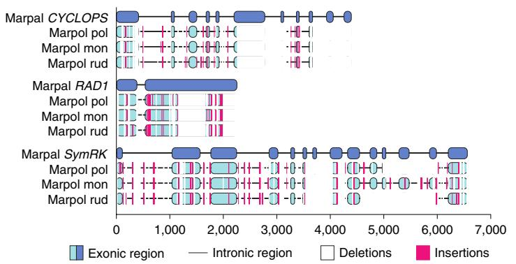

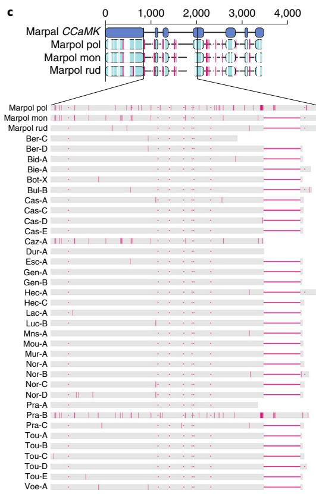  
Fig. 3 | Loss of symbiotic genes following mutualism abandonment in Marchantia. a, Ink-stained transversal sections of M. paleacea (Marpal) and M. polymorpha ssp. ruderalis (Marpol rud), ssp. montivagans (Marpol mon) and ssp. polymorpha (Marpol pol). Arbuscules are present in the midrib of M. paleacea and absent from the three M. polymorpha subspecies. Similar results were observed in three independent experiments. Top images: scale bars 1 mm; bottom images: scale bars, 0.25 mm. b, M. paleacea gene models aligned with the corresponding pseudogenized loci from the three M. polymorpha subspecies. c, Multiple sequence alignment diversity in an approximately 1-kb region of CCaMK. Pseudogenization pattern in 35 M. polymorpha accessions compared with the three M. polymorpha subspecies. Red vertical lines indicate mismatches and white boxes and red horizontal lines indicate gaps

The symbiotic signalling pathway is conserved in species with intracellular symbioses. In contrast to RAD1, STR and STR2, the symbiosis signalling genes CCaMK, CYCLOPS and SymRK are not absent from all species that have lost AMS. To understand this mixed phylogenetic pattern, we investigated their conservation across species with diverse symbioses. CCaMK, CYCLOPS and SymRK were absent from seven genomes and fourteen transcriptomes of Pinaceae that form ectomycorrhizae but do not exhibit AMS. None of these genes were detected in the genome of the fern Azolla filiculoides or in the transcriptome of the liverwort B. pusilla, which have independently evolved associations with nitrogen fixing cyanobacteria but have lost AMS9 (Fig. 2 and Supplementary Figs. 13–15). During ectomycorrhizae, the symbiotic fungi colonize the intercellular space between epidermal cells and the first layer of cortical cells5. Similarly, in both A. filiculides and B. pusilla, nitrogen-fixing cyanobacteria are hosted in specific glands, but outside plant cells34,35. Therefore, all the lineages in our sampling that host fungal or bacterial symbionts exclusively outside their cells did not retain SymRK, CCaMK and CYCLOPS, suggesting that these genes are dispensable for extracellular symbiosis. Confirming this, knockdown analysis of CCaMK in poplar, which forms both AMS and ectomycorrhizae, resulted in only a quantitative decrease in ectomycorrhizae, whereas AMS was completely absent36.

All other lineages that switched from AMS to other types of mutualistic symbioses retained the three signalling genes SymRK, CCaMK and CYCLOPS (Fig. 2 and Supplementary Figs. 13–15). These lineages are scattered throughout the land-plant phylogeny, thus excluding the hypothesis of a lineage-specific retention of these genes. The three genes were found in the genomes of three Orchidaceae, Apostasia shenzhenica, Dendrobium catenatum and Phalaenopsis equestris and in the transcriptome of Bletilla striata37, which form orchid mycorrhizae with Basidiomycetes that develop intracellular pelotons5. The three genes were also detected in the transcriptomes of liverworts from the Jungermaniales order Scapania nemorosa (3/3), Calypogeia fissa (1/3), Odontoschisma prostratum (1/3), Bazzania trilobata (2/3) and Schistochila sp. (1/3), which have switched from AMS to diverse Ericoid-like associations with Basidiomycetes and Ascomycetes that form intracellular coils5. Furthermore, these genes are also conserved in the legume genus Lupinus, which associates with nitrogen-fixing rhizobia forming intracellular symbiosomes in root nodules, but has lost AMS38.

A unifying feature of these species that have preserved the symbiosis signalling pathway but lost AMS is their ability to engage in alternative intracellular mutualistic symbioses; we therefore suggest that these genes may be conserved specifically with intracellula symbioses throughout the plant kingdom. To test this hypothesis, we added to our initial analysis the only known intracellular mutu alistic symbiosis not covered in our sampling: ericoid mycorrhi zae, which evolved before the radiation of the angiosperm family

a  
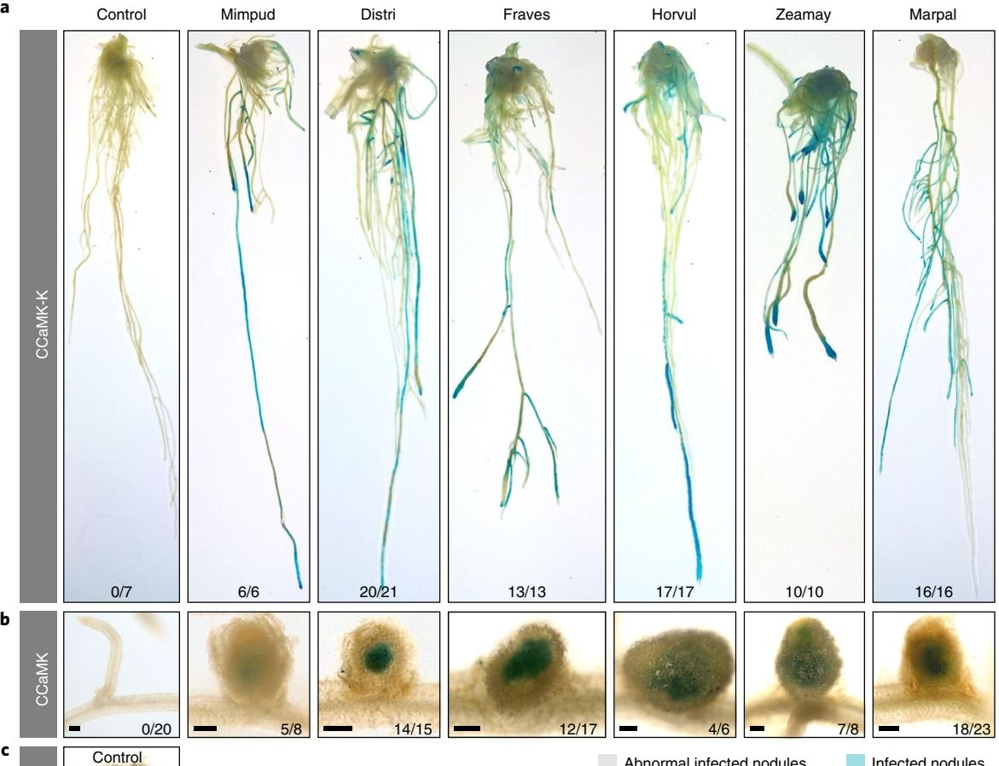

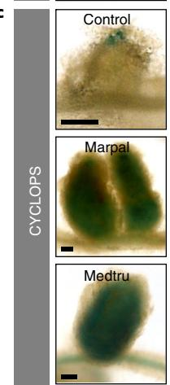

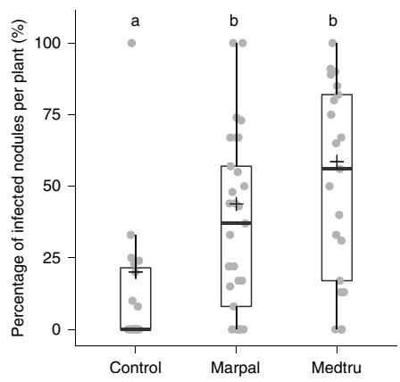

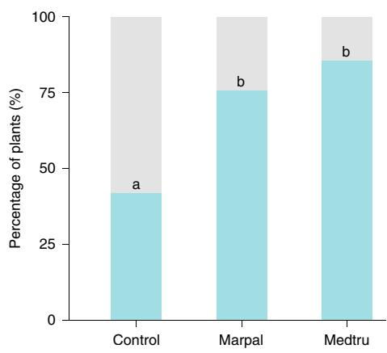  
Fig. 4 | Conservation of biochemical properties of CCaMK and CYCLOPS in land plants. a, M. truncatula pENOD11:GUS roots transformed with pUb:CCaMK-K from Mimosa pudica (Mimpud), Discaria trinervis (Distri), Fragaria vesca (Fraves), Hordeum vulgare (Horvul), Zea mays (Zeamay) and M. paleacea (Marpal) show strong activation of the ENOD11:GUS reporter (in blue). Control roots transformed with an empty vector show little or no GUS activity. Numbers of plants showing a strong ENOD11:GUS activation out of the total independent transformed plants are indicated. b, M. truncatula ccamk mutant roots transformed with pUb:CCaMK from M. pudica, D. trinervis. E vesca, H. vulaare. Z. mays and M. paleacea show infected nodules 26 d post-inoculation with Sinorhizobium meliloti LacZ. Bacteria in the nodules are stained blue. A representative infected nodule is shown for each CCaMK orthologue. Number of plants showing infected nodules out of the total transformed plants are indicated. Scale bars, 200 µm. c, M. truncatula cyclops mutant roots transformed with pUb:CYCLOPS from M. truncatula, M. paleacea and an empty vector (control) show nodules with variable infection level, whereas with the control plants most of the nodules are unifected or with arrested infection (as illustrated), with M. truncatula CYCLOPS and M. paleacea CYCLOPS, fully infected nodules are observed (as illustrated). The box plots show differences in the percentage of fully infected nodules per plant (n  19 (control), n  29 (M. paleacea), n  21 (M. truncatula)). ‘ ’ symbols indicate mean values. In box plots, the horizontal line shows the median, the box spans the first to third quartile, the top upper whisker represents the third quartile + 1.5× interquartile range and the lower whisker represents the first quartile − 1.5× interquartile range. Letters indicate different statistical groups after a FDR correction using a 0.95 threshold (Kruskal-Wallis rank–sum test; $\chi _ { \mathsf { C o n t r o l - M a r p a l } } ^ { 2 } = 7 . 9 3 4 3 , \chi _ { \mathsf { C o n t r o l - M e d t r u } } ^ { 2 } = 1 1 . 9 7 6 , \chi _ { \mathsf { M a r p a l - M e d t r u } } ^ { 2 } = 2 . 2 8 1 7 , \chi _ { \mathsf { C o n t r o l - M a r p a l - M a r p a l } } ^ { 2 } = 1 . 9 7 6 , \chi _ { \mathsf { N a r p a l - M a r p a l - M a r p a l } } ^ { 2 } ,$ . The bar plot shows the percentage of plants with fully infected nodules. Letters I I Iindicate different statistical groups (χ2 test of independence; $\chi _ { \mathsf { C o n t r o l - M a r p a l } } ^ { 2 } = 4 . 2 3 3 8 , \ \chi _ { \mathsf { C o n t r o l - M e d t u } } ^ { 2 } = 6 . 5 3 1 7 , \ \chi _ { \mathsf { M a r p a l - M e d t u } } ^ { 2 } = 0 . 2 5 1 4 4 )$ . Two independen biological replicates were conducted for each assay.

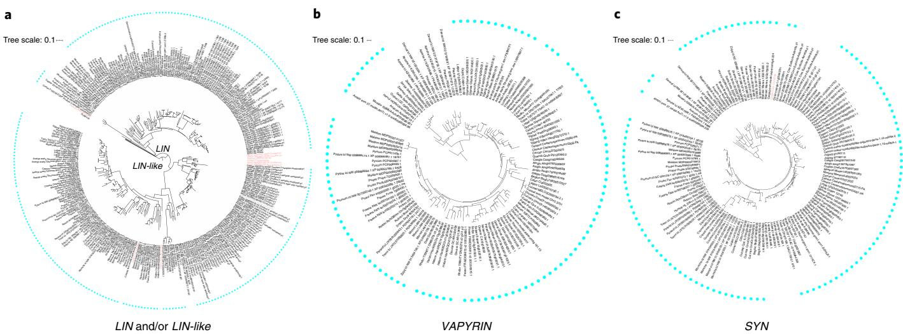  
Fig. 5 | Maximum-likelihood trees of infection-related genes. a, LIN and its paralogue LIN-like (model: GTR + F + R7); b, VAPYRIN (model: GTR + F + R6); c, SYN (model: TIM3 + F + R5). Due to the high duplication of the gene families, only the angiosperms clade is displayed for VAPYRIN and SYN; whereas gymnosperms were conserved for LIN and LIN-like, due to their divergence following the seed plants whole-genome duplication event. Full trees are shown in Supplementary Figs. 21, 22 and 28. LIN and/or LIN-like tree was rooted on non-seed plants; whereas VAPYRIN and SYN trees were rooted on Amborella trichopoda. Species names are coloured as follows: black, species with intracellular symbiosis; light red, species without intracellular infection; light grey, species with undetermined symbiotic status. Cyan dots indicate species forming AMS. High-resolution phylogenetic trees are available as Supplementary Figs. 9, 16, 21–23 and 28.

Ericaceae. In ericoid mycorrhiza, ascomycetes colonize epidermal root cells and develop intracellular hyphal complexes5. We collected available transcriptomic data from six species, assembled and annotated them, and specifically searched for the presence of SymRK, CCaMK, CYCLOPS, as well as STR, STR2 and RAD1. Congruent with the loss of AMS, RAD1, STR and STR2 were not detected (Supplementary Fig. 37); however, SymRK, CCaMK and CYCLOPS were present in the transcriptome of Rhododendron fortunei roots, but not in the other five transcriptomes derived from leaves or stems (Fig. 2 and Supplementary Fig. 37).

The receptor-like kinase SYMRK, the calcium- and calmodulin-dependent protein kinase CCaMK and the transcription factor CYCLOPS are known components of the common symbiosis signalling pathway and contribute successive steps in the signalling processes triggered by arbuscular mycorrhizal fungi and nitrogen-fixing bacteria2,39. Genetic analysis of SymRK, CCaMK and CYCLOPS have been conducted in multiple angiosperms, including dicots from the Fabaceae, Casuarinaceae, Fagaceae, Rosaceae and Solanaceae families as well as in monocots such as rice40–43. In all these species, defects in any of these three genes resulted in aborted or strongly attenuated intracellular infection by arbuscular mycorrhizal fungi. In addition, knockout or knockdown of any of these genes in rootnodule symbiosis-forming species resulted in impaired intracellular infection by nitrogen-fixing bacteria2,39. Conversely, CCaMK knockdown in the Fabaceae Sesbania rostrata did not impact extracellular infection of cortical cells by nitrogen-fixing rhizobia44. Together with this genetic evidence, our results demonstrate that SymRK, CCaMK and CYCLOPS specifically occur in species that accommodate intracellular symbionts, defining a universal signalling pathway for intracellular mutualistic symbioses in plants.

Conservation of CCaMK and CYCLOPS biochemical prop erties in land plants. We propose that the symbiosis signalling pathway has been co-opted for all intracellular endosymbioses in land plants; this would imply conservation of the biochemical properties of the corresponding proteins over the 450 million years of land plant evolution. To test this hypothesis, we cloned CCaMK from three dicots forming AMS or both AMS and root-nodule symbiosis, from two monocots forming only AMS and from the liverwort M. paleacea, which forms AMS in the absence of roots.

Two assays were used to assess the conservation of the biochemical properties of these CCaMK orthologues. First, truncated versions that only contain the kinase domain of CCaMK (CCaMK-K) were cloned under control of a constitutive promoter. If functional, these constructs are expected to induce the expression of root-nodule symbiosis reporter genes such as ENOD1145 when overexpressed in the Fabales M. truncatula roots in the absence of symbiotic bacte ria, as does the M. truncatula CCaMK-K construct45. The constructs were introduced in a M. truncatula pENOD11:GUS background and GUS activity was monitored in the absence of symbiotic bacteria. CCaMK-K from every tested species resulted in the spontaneous activation of the pENOD11:GUS reporter (Fig. 5). As a second test of the conservation of CCaMK, trans-complementation assays of a M. truncatula ccamk (dmi3) mutant were complemented with CCaMK orthologues from the above species. In the presence of symbiotic bacteria, all of the CCaMK orthologues were able to restore nodule formation and intracellular infection in the ccamk mutant (Fig. 4 and Supplementary Table 5).

In legumes, CCaMK phosphorylates CYCLOPS. Phosphorylated CYCLOPS then binds to the promoter and activates the transcription of downstream genes46. To determine whether the CCaMK– CYCLOPS module itself is biochemically conserved across land plants, we conducted trans-complementation assays of a M. truncatula cyclops (ipd3) mutant with M. paleacea CYCLOPS. Nodules can be formed in the M. truncatula cyclops mutant due to the presence of a functional paralogue47. In our assay, M. truncatula cyclops mutants transformed with the empty vector could develop root nodules, but were mostly uninfected. By contrast, transformation with either M. truncatula CYCLOPS or M. paleacea CYCLOPS resulted in the formation of many fully infected nodules in most of the trans formed cyclops roots (Fig. 4).

In sum, these assays indicate that CYCLOPS and CCaMK orthologues that evolved in different symbiotic (AMS, root-nodule symbiosis and both) and developmental (gametophytes in M. paleacea and root sporophytes in angiosperms) contexts have conserved biochemical properties.

Infection-related genes are conserved in angiosperms with intracellular symbioses. For a given gene with dual biological functions, co-elimination is not predicted to occur following the loss of a single trait because of the selection pressure exerted by the other, still present, trait12. For instance, DELLA proteins that are involved in AMS and have essential roles in gibberellic-acid signalling are retained in all embryophytes48. To become sensitive to co-elimination, a gene must become specific for a single trait. This may occur via successive losses of traits or via gene duplication leading to subfunctionalization between the two paralogues12. Angiosperm genomes have experienced multiple rounds of whole-genome duplications49, and we hypothesized that besides the common symbiotic signalling pathway, other genes might be specialized for intracellular symbioses following subfunctionalization. We screened our phylogenies for genes that are retained in angiosperm species forming intracellular symbioses but lost in those that have undergone mutualism abandonment. Six genes followed this pattern: KinF, EPP1, VAPYRIN, LIN and/or LIN-like, CASTOR and SYN (Fig. 5 and Supplementary Figs. 9, 16, 21–23 and 28). Among them, CASTOR and, to some extent, EPP150 are components of the common symbiotic signalling pathway, while VAPYRIN and LIN and/or LIN-like are directly involved in the formation of a structure required for the intracellular accommodation of rhizobial bacteria51–53, and also function in intracellular accommodation of arbuscular mycorrhizal fungi54–56. Similarly, SYN has been characterized in M. truncatula for its role in the formation of the intracellular structures during both AMS and root-nodule symbiosis57.

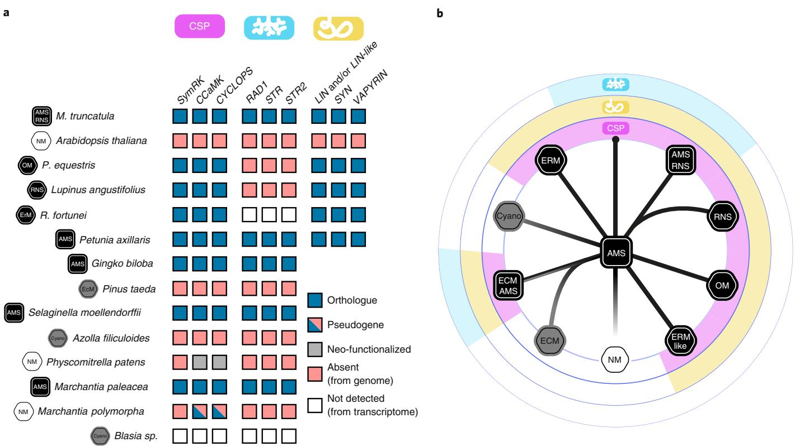  
Fig. 6 | Model for the conservation of symbiotic genes across symbiosis types. a, The common symbiosis pathway (CSP) genes SymRK, CCaMK and CYCLOPS in all land plants. RAD1, STR and STR2 are conserved exclusively in species with AMS. The infection-related genes (that is, VAPYRIN, SYN and LIN and/or LIN-like) in angiosperms are specific to species forming intracellular symbiosis (black background). Mutualism abandonment (NM, white) or loss of intracellular symbiosis (grey) result in the loss of all these genes. The pink symbol indicates the CSP, the cyan symbol indicates genes specifically involved in AMS and the yellow symbol indicates genes linked to infection by intracellular symbionts. b, Schematic representation of transition among symbiotic types and the conservation of the corresponding genes across land plants. Cyano, cyanobacteria association; ErM, ericoid mycorrhiza; ErM-like ericoid-like mycorrhiza.

These results demonstrate that, besides the common symbiotic signalling pathway, genes directly involved in the intracellular accommodation of symbionts are exclusively maintained in species that form intracellular mutualistic symbioses in angiosperms, irrespective of the type of symbiont or the plant lineage. Pro-orthologues of these genes are found in species outside the angiosperms in both symbiotic and non-symbiotic species. Given the overall cellular and molecular conservation observed in AMS processes in land plants, we hypothesize that these genes most probably have an endosym biotic function in species outside of the angiosperms, but the lack of gene erosion of these genes in non-angiosperms suggests that they have an additional function that ensures their retention. In angiosperms, we see loss of these genes concomitant with the loss of intracellular symbioses, suggesting either that their essential func tion is now redundant in angiosperms or is supported by gene paralogues resulting from the whole-genome duplications that predate modern angiosperms.

## Conclusions

Through comprehensive phylogenomics of previously unexplored plant lineages, we demonstrate that three genes are evolutionary linked to AMS in all land plants, including two directly involved in the transfer of lipids from the host plant to arbuscular mycorrhi zal fungi. We propose that the symbiotic transfer of lipids has been essential for the conservation of AMS in land plants. Surprisingly, we found that genes associated with symbiosis signalling are invariantly conserved in all land plant species possessing intracellular symbionts, implying repeated recruitment of this signalling pathway, independently of the nature of the intracellular symbiont. Furthermore, we see evidence for conservation of genes associated with the formation of the cellular structure necessary for intracellular accommodation of symbionts, but this correlation is restricted to angiosperms that have duplicated many of these components. Our results provide compelling evidence for the early emergence of genes associated with accommodation of intracellular symbionts, with the onset of AMS in the earliest land plants and then recruitment and retention of these processes during symbiont switches that have occurred on many independent occasions in the 450 million yr of land-plant evolution (Fig. 6). Our work also suggests that mutualistic interactions involving extracellular symbionts do not utilize the same molecular machinery as intracellular symbioses, suggesting an alternative evolutionary trajectory for the emergence of ectomycorrhizal and cyanobacterial associations.

## Methods

M. paleacea. Plant material. M. paleacea thalli previously collected in Mexico (Humphreys) were provided by K. J. Field and D. J. Beerling (Te University of Shefeld). Gemmae from these thalli were collected using a micropipette tip and placed into a microcentrifuge tube. A 5% solution of sodium hypochlorite was used to sterilize the gemmae for about 30 s followed by rinsing with sterile water 5 times to remove residual sodium hypochlorite solution. Te sterilized gemmae were grown on Gamborg’s half-strength B5 medium on sterile tissue culture plates under a 16:8 h day:night cycle at 22 °C under fuorescent illumination with a light intensity of 100 µmol µm−2 s.

DNA and RNA extraction. Genomic DNA from eight-week-old M. paleacea thalli were extracted as described previously58. RNA extraction was also carried out from eight-week-old M. paleacea thalli using the RNeasy mini plant kit following the manufacturer’s protocols. Fragmentation of RNA and cDNA synthesis were done using kits from New England Biolabs according to the manufacturer’s protocols with minor modifications. In brief, 1 µg of total RNA was used to purify mRNA on Oligo dT coupled to paramagnetic beads (NEBNext Poly(A) mRNA Magnetic Isolation Module). Purified mRNA was fragmented and eluted from the beads in one step by incubation in 2× first-strand buffer at 94 °C for 7 min, followed by first-strand cDNA synthesis using random-primed reverse transcription (NEBNext RNA First Strand Synthesis Module), followed by random-primed second-strand synthesis using an enzyme mixture of DNA PolI, RnaseH and Escherichia coli DNA Ligase (NEBNext Second Strand Synthesis Module).

Genome sequencing. For the M. paleacea genome sequencing, short-insert pairedend and long-insert mate-pair libraries were produced. For the paired-end library, the DNA fragmentation was done using Adaptive Focused Acoustic technology (Covaris). The NEBNext Ultra DNA Library Prep Kit (New England Biolabs) was used for the library preparation, and the bead size selection for 300–400 base pairs (bp) based on the manufacturer’s protocol. The library had an average insert size of 336 bp. For the mate-pair library, preparation was done using the Nextera Mate-Pair DNA library prep kit (Illumina) following the manufacturer’s protocol. After enzymatic fragmentation, we used gel size selection for 3–5 kb fragments. The average size that was recovered from the gel was 4,311 bp. Sequencing was carried out on an Illumina HiSeq2500 on 2 × 100 bp Rapid Run mode. The library preparation and sequencing were carried out by Genewiz.

Genome assembly. Adapter and quality trimming were performed on the pairedend library using Trimmomatic v.0.33 using the following parameters (ILLUMINA CLIP:TruSeq2-PE.fa:2:30:10 LEADING:3 TRAILING:3 SLIDINGWINDOW:4:15 MINLEN:12). The trimmed paired-end reads were carried forward for assembling the contigs using multiple assemblers. Scaffolding of the contigs was done using the scaffolder of SOAPdenovo259 with the mate-pair library after processing the reads through the NextClip60 pipeline to only retain predicted genuine long-insert mate pairs. Assembly completeness was measured using the BUSCO61 plants dataset.

Transcriptome sequencing. cDNA was purified and concentrated on MinElute Columns (Qiagen) and used to construct an Illumina library using the Ovation Rapid DR Multiplex System 1–96 (NuGEN). The library was amplified using MyTaq (Bioline) and standard Illumina TruSeq amplification primers. PCR primer and small fragments were removed by Agencourt XP bead purification. The PCR components were removed using an additional purification on Qiagen MinElute Columns. Normalization was done using Trimmer Kit (Evrogen). The normalized library was re-amplified using MyTaq (Bioline) and standard Illumina TruSeq amplification primers. The normalized library was finally size-selected on a lowmelting-point agarose gel, removing fragments smaller than 350 bp and those larger than 600 bp. Sequencing was done on an Illumina MiSeq in 2 × 300 bp mode. The RNA extractions, cDNA synthesis library preparation and sequencing were carried out by LGC Genomics.

B. pusilla. B. pusilla was originally collected from Windham County, Connecticut, USA, and maintained in a Duke University greenhouse. RNA was extracted from plants with symbiotic cyanobacterial colonies using Sigma Spectrum Plant Total RNA kit. Library preparation and sequencing were done by BGI Shenzhen. A Ribo-Zero rRNA Removal Kit was used to prepare the transcriptome library. In total, 3 libraries were constructed, which were sequenced on the Illumina Platform Hiseq2000 as 150 bp paired-ends, with insert size of 200 bp.

M. polymorpha subspecies. Plant material and DNA extraction. Sterilized gemmae from one individual each of M. polymorpha ssp. montivagans (sample id MpmSA2) and M. polymorpha ssp. polymorpha (sample id MppBR5) were grown as for M. paleacea and isolated for DNA extraction. DNA was extracted with a modifed cetyl trimethylammonium bromide protocol58.

Genome sequencing. DNA were sequenced with single-molecule real-time sequencing technology developed by Pacific BioSciences on a PacBio Sequel System with Sequel chemistry and sequence depth of 60× (ref. 62).

Genome assembly. The reads were assembled using HGAP 463. Assembly statistics were assessed using QUAST64 v.4.5.4, BUSCO61 v.3.0.2 and CEGMA65 v.2.5.

Reporting Summary. Further information on research design is available in the Nature Research Reporting Summary linked to this article.

## Data availability

All assemblies and gene annotations generated in this project can be found in SymDB (www.polebio.lrsv.ups-tlse.fr/symdb/). Raw sequencing data can be found under NCBI Bioproject PRJNA576233 (B. pusilla), PRJNA362997 and PRJNA362995 (M. paleacea genome and transcriptome, respectively) and PRJNA576577 (M. polymorpha ssp. montivagans and ssp. polymorpha).

Received: 14 October 2019; Accepted: 31 January 2020; Published online: 2 March 2020

## References

1. Gensel, P. G. Te Emerald Planet: How Plants Changed Earth’s History (Oxford Univ. Press, 2008).

2. Parniske, M. Arbuscular mycorrhizae: the mother of plant root endosymbioses. Nat. Rev. Microbiol. 6, 763–775 (2008).

3. Delaux, P. M., Séjalon-Delmas, N., Bécard, G. & Ané, J. M. Evolution of the plant–microbe symbiotic ‘toolkit’. Trends Plant Sci. 18, 298–304 (2013).

4. Werner, G. D. A. et al. Symbiont switching and alternative resource acquisition strategies drive mutualism breakdown. Proc. Natl Acad. Sci. USA 115, 5229–5234 (2018).

5. Smith, S. & Read, D. Mycorrhizal Symbiosis (Academic Press, 2008).

6. Kottke, I. et al. Heterobasidiomycetes form symbiotic associations with hepatics: Jungermanniales have sebacinoid mycobionts while Aneura pinguis (Metzgeriales) is associated with a Tulasnella species. Mycol. Res. 107, 957–968 (2003).

7. Griesmann, M. et al. Phylogenomics reveals multiple losses of nitrogen-fxing root nodule symbiosis. Science 361, eaat1743 (2018).

8. Wang, B. & Qiu, Y. L. Phylogenetic distribution and evolution of mycorrhizas in land plants. Mycorrhiza 16, 299–363 (2006).

9. Delaux, P. M., Radhakrishnan, G. & Oldroyd, G. Tracing the evolutionary path to nitrogen-fxing crops. Curr. Opin. Plant Biol. 26, 95–99 (2015).

10. Martin, F. M., Uroz, S. & Barker, D. G. Ancestral alliances: plant mutualistic symbioses with fungi and bacteria. Science 356, eaad4501 (2017).

11. van Velzen, R. et al. Comparative genomics of the nonlegume Parasponia reveals insights into evolution of nitrogen-fxing rhizobium symbioses. Proc. Natl Acad. Sci. USA 115, E4700–E4709 (2018).

12. Albalat, R. & Cañestro, C. Evolution by gene loss. Nat. Rev. Genet. 17, 379–391 (2016).

13. Tabach, Y. et al. Identifcation of small RNA pathway genes using patterns of phylogenetic conservation and divergence. Nature 493, 694–698 (2013).

14. Delaux, P. M. Comparative phylogenomics of symbiotic associations. New Phytol. 213, 89–94 (2017).

15. Dey, G., Jaimovich, A., Collins, S. R., Seki, A. & Meyer, T. Systematic discovery of human gene function and principles of modular organization through phylogenetic profling. Cell Rep. 10, 993–1006 (2015).

16. Bravo, A., York, T., Pumplin, N., Mueller, L. A. & Harrison, M. J. Genes conserved for arbuscular mycorrhizal symbiosis identifed through phylogenomics. Nat. Plants 2, 15208 (2016).

17. Delaux, P. M. et al. Comparative phylogenomics uncovers the impact of symbiotic associations on host genome evolution. PLoS Genet. 10, e1004487 (2014).

18. Favre, P. et al. A novel bioinformatics pipeline to discover genes related to arbuscular mycorrhizal symbiosis based on their evolutionary conservation pattern among higher plants. BMC Plant Biol. 14. 333 (2014)

19. Xue, L. et al. Network of GRAS transcription factors involved in the control of arbuscule development in Lotus japonicus. Plant Physiol. 167, 854–871 (2015).

20. Keymer, A. et al. Lipid transfer from plants to arbuscular mycorrhiza fungi eLife 6, e29107 (2017).

21. Bravo, A., Brands, M., Wewer, V., Dörmann, P. & Harrison, M. J. Arbuscular mycorrhiza-specifc enzymes FatM and RAM2 fne-tune lipid biosynthesis to promote development of arbuscular mycorrhiza. New Phytol. 214, 1631–1645 (2017).

22. Grosche, C., Genau, A. C. & Rensing, S. A. Evolution of the symbiosis-specifc GRAS regulatory network in bryophytes. Front. Plant Sci. 9, 1621 (2018).

23. Delaux, P.-M. et al. Algal ancestor of land plants was preadapted for symbiosis. Proc. Natl Acad. Sci. USA 112, 13390–13395 (2015).

24. Wang, B. et al. Presence of three mycorrhizal genes in the common ancestor of land plants suggests a key role of mycorrhizas in the colonization of land by plants. New Phytol. 186, 514–525 (2010).

25. Humphreys, C. P. et al. Mutualistic mycorrhiza-like symbiosis in the most ancient group of land plants. Nat. Commun. 1, 103 (2010).

26. Bowman, J. L. et al. Insights into land plant evolution garnered from the Marchantia polymorpha genome. Cell 171, 287–304 (2017).

27. Brundrett, M. & Tedersoo, L. Misdiagnosis of mycorrhizas and inappropriate recycling of data can lead to false conclusions. New Phytol. 221, 18–24 (2019).

28. Villarreal A, J. C., Crandall-Stotler, B. J., Hart, M. L., Long, D. G. & Forrest, L. L. Divergence times and the evolution of morphological complexity in an early land plant lineage (Marchantiopsida) with a slow molecular rate. New Phytol. 209, 1734–1746 (2016).

29. Read, D. J. & Perez-Moreno, J. Mycorrhizas and nutrient cycling in ecosystems—a journey towards relevance? New Phytol. 157, 475–492 (2003).

30. Rey, T. et al. Te Medicago truncatula GRAS protein RAD1 supports arbuscular mycorrhiza symbiosis and Phytophthora palmivora susceptibility. J. Exp. Bot. 68, 5871–5881 (2017).

31. Park, H.-J., Floss, D. S., Levesque-Tremblay, V., Bravo, A. & Harrison, M. J. Hyphal branching during arbuscule development requires RAM1. Plant Physiol. 169, 2774–2788 (2015).

32. Luginbuehl, L. H. et al. Fatty acids in arbuscular mycorrhizal fungi are synthesized by the host plant. Science 356, 1175–1178 (2017).

33. Jiang, Y. et al. Plants transfer lipids to sustain colonization by mutualistic mycorrhizal and parasitic fungi. Science 356, 1172–1175 (2017).

34. Adams, D. G. Te Ecology of cyanobacteria: their diversity in time and space (Kluwer, 2000); https://doi.org/10.1016/0303-2647(92)90025-T

35. Li, F. W. et al. Fern genomes elucidate land plant evolution and cyanobacterial symbioses. Nat. Plants 4, 460–472 (2018).

36. Cope, K. R. et al. Te ectomycorrhizal fungus Laccaria bicolor produces lipochitooligosaccharides and uses the common symbiosis pathway to colonize Populus roots. Plant Cell 31, 2386–2410 (2019).

37. Miura, C. et al. Te mycoheterotrophic symbiosis between orchids and mycorrhizal fungi possesses major components shared with mutualistic plant–mycorrhizal symbioses. Mol. Plant Microbe Interact. 31, 1032–1047 (2018).

38. Oba, H., Tawaray, K. & Wagatsuma, T. Arbuscular mycorrhizal colonization in Lupinus and related genera. Soil Sci. Plant Nutr. 47, 685–694 (2001).

39. Oldroyd, G. E. D. Speak, friend, and enter: signalling systems that promote benefcial symbiotic associations in plants. Nat. Rev. Microbiol. 11, 252–263 (2013).

40. Gutjahr, C. et al. Arbuscular mycorrhiza-specifc signaling in rice transcends the common symbiosis signaling pathway. Plant Cell 20, 2989–3005 (2008).

41. Gherbi, H. et al. SymRK defnes a common genetic basis for plant root endosymbioses with arbuscular mycorrhiza fungi, rhizobia, and Frankiabacteria. Proc. Natl Acad. Sci. USA 105, 4928–4932 (2008).

42. Svistoonof, S. et al. Te independent acquisition of plant root nitrogen-fxing symbiosis in fabids recruited the same genetic pathway for nodule organogenesis. PLoS ONE 8, e64515 (2013).

43. Buendia, L., Wang, T., Girardin, A. & Lefebvre, B. Te LysM receptor-like kinase SlLYK10 regulates the arbuscular mycorrhizal symbiosis in tomato New Phytol. 210, 184–195 (2016).

44. Capoen, W. et al. Calcium spiking patterns and the role of the calcium calmodulin-dependent kinase CCaMK in lateral root base nodulation of Sesbania rostrata. Plant Cell 21, 1526–1540 (2009).

45. Gleason, C. et al. Nodulation independent of rhizobia induced by a calciumactivated kinase lacking autoinhibition. Nature 441, 1149–1152 (2006).

46. Singh, S., Katzer, K., Lambert, J., Cerri, M. & Parniske, M. CYCLOPS, A DNA-binding transcriptional activator, orchestrates symbiotic root nodule development. Cell Host Microbe 15, 139–152 (2014).

47. Jin, Y. et al. IPD3 and IPD3L function redundantly in rhizobial and mycorrhizal symbioses. Front. Plant Sci. 9, 267 (2018).

48. Yasumura, Y., Crumpton-Taylor, M., Fuentes, S. & Harberd, N. P. Step-by-step acquisition of the gibberellin–DELLA growth-regulatory mechanism during land-plant evolution. Curr. Biol. 17, 1225–1230 (2007).

49. Soltis, P. S. & Soltis, D. E. Ancient WGD events as drivers of key innovations in angiosperms. Curr. Opin. Plant Biol. 30, 159–165 (2016).

50. Valdés-López, O. et al. A novel positive regulator of the early stages of root nodule symbiosis identifed by phosphoproteomics. Plant Cell Physiol. 60, 575–586 (2019).

51. Murray, J. D. et al. Vapyrin, a gene essential for intracellular progression of arbuscular mycorrhizal symbiosis, is also essential for infection by rhizobia in the nodule symbiosis of Medicago truncatula. Plant J. 65, 244–252 (2011).

52. Imaizumi-Anraku, H. et al. Plastid proteins crucial for symbiotic fungal and bacterial entry into plant roots. Nature 433, 527–531 (2005).

53. Liu, C. W. et al. A protein complex required for polar growth of rhizobial infection threads. Nat. Commun. 10, 2848 (2019).

54. Pumplin, N. et al. Medicago truncatula vapyrin is a novel protein required for arbuscular mycorrhizal symbiosis. Plant J. 61, 482–494 (2010).

55. Feddermann, N. et al. Te PAM1 gene of petunia, required for intracellular accommodation and morphogenesis of arbuscular mycorrhizal fungi, encode a homologue of VAPYRIN. Plant J. 64, 470–481 (2010).

56. Takeda, N., Tsuzuki, S., Suzaki, T., Parniske, M. & Kawaguchi, M. CERBERUS and NSP1 of Lotus japonicus are common symbiosis genes that modulate arbuscular mycorrhiza development. Plant Cell Physiol. 54, 1711–1723 (2013)

57. Huisman, R. et al. A symbiosis-dedicated SYNTAXIN OF PLANTS 13II isoform controls the formation of a stable host–microbe interface in symbiosis. New Phytol. 211, 1338–1351 (2016).

58. Healey, A., Furtado, A., Cooper, T. & Henry, R. J. A simple method for extracting next-generation sequencing quality genomic DNA from recalcitrant plant species. Plant Methods 10, 1–8 (2014).

59. Luo, R. et al. Erratum: SOAPdenovo2: an empirically improved memoryefcient short-read de novo assembler. Gigascience 4, 30 (2015).

60. Leggett, R. M., Clavijo, B. J., Clissold, L., Clark, M. D. & Caccamo, M. Next clip: an analysis and read preparation tool for nextera long mate pair libraries. Bioinformatics 30, 566–568 (2014).

61. Simão, F. A., Waterhouse, R. M., Ioannidis, P., Kriventseva, E. V. & Zdobnov, E. M. BUSCO: assessing genome assembly and annotation completeness with single-copy orthologs. Bioinformatics 31, 3210–3212 (2015).

62. Roberts, R. J., Carneiro, M. O. & Schatz, M. C. Te advantages of SMRT sequencing. Genome Biol. 14, 405 (2013).

63. Chin, C. S. et al. Nonhybrid, fnished microbial genome assemblies from long-read SMRT sequencing data. Nat. Methods 10, 563–569 (2013).

64. Gurevich, A., Saveliev, V., Vyahhi, N. & Tesler, G. QUAST: Quality assessment tool for genome assemblies. Bioinformatics 29, 1072–1075 (2013).

65. Parra, G., Bradnam, K. & Korf, I. CEGMA: a pipeline to accurately annotate core genes in eukaryotic genomes. Bioinformatics 23, 1061–1067 (2007).

## Acknowledgements

This work was supported by the Agence Nationale de la Recherche (ANR) gran EVOISYM (ANR-17-CE20-0006-01) to P.-M.D., by the Bill and Melinda Gates Foundation as Engineering the Nitrogen Symbiosis for Africa (OPP1172165), by the BBSRC as OpenPlant to G.E.D.O (BB/L014130/1), by the 10KP initiative (BGI Shenzhen). by the National Science Foundation (DEB1831428) to E-WL. and by the Swedish Research Council Vetenskapsrådet (VR) to U.L. (2011‐5609 and 2014‐522) and to D.M.E (2016-05180). G.V.R is additionally supported by a Biotechnology and Biological Sciences Research Council Discovery Fellowship (BB/S011005/1). Part of this work was conducted at the Laboratoire de Recherche en Sciences Végétales (LRSV) laboratory, which belongs to the TULIP Laboratoire d’Excellence (ANR-10-LABX-41) We are grateful to the genotoul bioinformatics platform Toulouse Midi–Pyrenees for providing computing and storage resources. We thank F. Roux for helping with the collection of M. polymorpha accessions, A. Cooke for assistance with M. paleacea DNA extraction, P. Szoevenyi for advice on M. polymorpha DNA extraction, and D. Barker and members of the Engineering Nitrogen Symbiosis for Africa (ENSA) project for helpfu comments and discussion. Figure 6b was prepared by J. Calli (www.jeremy-calli.fr).

## Author contributions

P.-M.D., G.V.R., M.K.R., J.K., G.E.D.O. and T.V. conceived the experiments; J.K., H.S.C. and L.C. developed symDB; G.V.R., M.K.R., J.K., T.V., D.L.M.M., N.V., C.L., J.C. and P.-M.D. conducted the experiments; A.-M.L., D.M.E. and U.L. generated the M. polymorpha subspecies genomes; F.-W.L., S.C. and G.K.S.W. generated the B. pusilla transcriptome; P.-M.D., G.V.R., M.K.R., J.K. and T.V. analysed the data; J.K. compiled the supplementary material; G.V.R., M.K.R., G.E.D.O. and P.-M.D. wrote the manuscript.

## Competing interests

The authors declare no competing interests.

## Additional information

Supplementary information is available for this paper at https://doi.org/10.1038 s41477-020-0613-7

Correspondence and requests for materials should be addressed to G.E.D.O. or P.-M.D. Peer review information Nature Plants thanks Andrea Genre and the other, anonymous, reviewer(s) for their contribution to the peer review of this work

Reprints and permissions information is available at www.nature.com/reprints.

Publisher’s note Springer Nature remains neutral with regard to jurisdictional claims in published maps and institutional affiliations.

© The Author(s), under exclusive licence to Springer Nature Limited 2020

# natureresearch

Last updated by author(s): 23/01/2020

# Reporting Summary

Nature Research wishes to improve the reproducibility of the work that we publish. This form provides structure for consistency and transparency in reporting. For further information on Nature Research policies, see Authors & Referees and the Editorial Policy Checklist

## Statistics

<table><tr><td colspan="2">For all statistical analyses, confirm that the following items are present in the figure legend, table legend, main text, or Methods section.</td></tr><tr><td>n/a</td><td>Confirmed</td></tr><tr><td></td><td>The exact sample size (n) for each experimental group/condition, given as a discrete number and unit of measurement</td></tr><tr><td></td><td>A statement on whether measurements were taken from distinct samples or whether the same sample was measured repeatedly</td></tr><tr><td></td><td>The statistical test(s) used AND whether they are one- or two-sidedOnly common tests should be described solely by name; describe more complex techniques in the Methods section.</td></tr><tr><td></td><td>A description of all covariates tested</td></tr><tr><td></td><td>A description of any assumptions or corrections, such as tests of normality and adjustment for multiple comparisons</td></tr><tr><td></td><td>A full description of the statistical parameters including central tendency (e.g. means) or other basic estimates (e.g. regression coefficient)AND variation (e.g. standard deviation) or associated estimates of uncertainty (e.g. confidence intervals)</td></tr><tr><td></td><td>For null hypothesis testing, the test statistic (e.g. F, t, r) with confidence intervals, effect sizes, degrees of freedom and P value notedGive P values as exact values whenever suitable.</td></tr><tr><td></td><td>For Bayesian analysis, information on the choice of priors and Markov chain Monte Carlo settings</td></tr><tr><td></td><td>For hierarchical and complex designs, identification of the appropriate level for tests and full reporting of outcomes</td></tr><tr><td></td><td>Estimates of effect sizes (e.g. Cohen&#x27;s d, Pearson&#x27;s r), indicating how they were calculated</td></tr></table>

## Software and code

<table><tr><td colspan="2">Policy information about availability of computer code</td></tr><tr><td>Data collection</td><td>Candidate genes homologs sequences were retrieved using the open-source program BLAST+ v2.7.1</td></tr><tr><td>Data analysis</td><td>All programs and software used in this study are free and open-source.Sequences were aligned using MAFFT v7.407 and MUSCLE v3.8.3 (multiple sequences aligners), alignments were trimmed using trimAL v1.2 (tool for trimming spurious/poorly aligned sequences) and phylogenetic analysis were performed using IQ-TREE v1.6.7 (phylogenomic dedicated ML software), prior to ML analysis, best evolutionary model was selected using ModelFinder. Trees were annotated using the iTOLv4.4.2 platform.Statistical analysis and graph drawn in R v3.6.0; RStudio v1.2.1335 and the following packages: ggplot2, tidyverse, xlsx, multcomp, multcompview, seqinr, remotes, ape, dplyr, naniar.Selective pressure analysis were conducted using the ETE Toolkit v3.1.1 and HyPhy RELAX 2.5.0.Assembly of Sanger sequences was performed using Tracy v0.5.5.Transcriptomes from the 1KP project were annotated using the TransDecoder pipeline v5.5.0.The genome of Marchantia paleacea was assembled using SPAdes v3.11 and scaffolded using SOAPdenovo2 v2.0.The transcriptomes of Marchantia paleacea and Blasia pusilla were assembled using Trinity v2.4.0 and annotated using the TransDecoder pipeline v2.1.0.The genomes of Marchantia polymorpha subspecies montivagans and polymorpha were assembled using HGAP v4.0Genomic alignments of syntenic regions between Marchantia species were conducted using Mauve v2.3.1.</td></tr><tr><td colspan="2">For manuscripts utilizing custom algorithms or software that are central to the research but not yet described in published literature, software must be made available to editors/reviewers.We strongly encourage code deposition in a community repository (e.g. GitHub). See the Nature Research guidelines for submitting code &amp; software for further information.</td></tr></table>

Did the study involve field work? Yes No

## Data

Policy information about availability of data

All manuscripts must include a data availability statement. This statement should provide the following information, where applicable:

\- Accession codes, unique identifiers, or web links for publicly available datasets

\- A list of figures that have associated raw data

\- A description of any restrictions on data availability

All data used in the manuscript are being made available in the database SymDB - http://www.polebio.lrsv.ups-tlse.fr/symdb/ The draft assemblies and raw sequencing data for the genome and transcriptome of Marchantia paleacea have been deposited at NCBI under PRJNA362997 and PRJNA362995 respectively.

## Field-specific reporting

Please select the one below that is the best fit for your research. If you are not sure, read the appropriate sections before making your selection.

Behavioural & social sciences

For a reference copy of the document with all sections, see nature.com/documents/nr-reporting-summary-flat.pdf

## Ecological, evolutionary & environmental sciences study design

All studies must disclose on these points even when the disclosure is negative.

<table><tr><td>Study description</td><td>The study includes the phylogenetic analysis of candidate genes on a large set of genomes and transcriptomes, as well as transcomplementation assays of angiosperm mutants</td></tr><tr><td>Research sample</td><td>This dataset is composed of publicly available genomes and transcriptomes as well as newly sequenced ones. All data have been made available on symDB (http://vm-polebio.toulouse.inra.fr/symdb/web/) and the citing information and the Fort Lauderdale agreement information are mentioned (read me file).For the transcomplementation assays presented in Figure 5, data were collected by visual inspection of the root systems under a dissecting scope.</td></tr><tr><td>Sampling strategy</td><td>Genomes and transcriptomes were collected to cover the main land plant clades (hornworts, liverworts, mosses, lycophytes, ferns, gymnosperms and angiosperms).</td></tr><tr><td>Data collection</td><td>Gene collection was conducted using BLAST (tBLASTn and BLASTp) on the above mentioned set of genomes and transcriptomes.</td></tr><tr><td>Timing and spatial scale</td><td>Marchantia accessions used to run the PCR and sequencing presented in Figure 2 and Supplementary Figure 36 were collected in spring and summer 2018.</td></tr><tr><td>Data exclusions</td><td>For the phylogenetic analyses, partial transcripts that are abundant in the transcriptomes from the 1KP project were removed with a threshold of 60% -length of the M. truncatula query.</td></tr><tr><td>Reproducibility</td><td>Data presented in Figure 5 have been replicated at least twice, as indicated in the material and methods and each replicate include multiple independently transformed root system (as indicated in the legend). All attempt at replication were successful</td></tr><tr><td>Randomization</td><td>Data presented in Figure 5b and c were obtained on plants growing in containers (25 pots / containers). Each container included plants transformed with the different test constructs. Data presented in Figure 5a were obtained on plants growing on plates, with plants transformed by a given constructs in the same plate. Multiple assays were conducted to limit for plate effect, with the negative control included in each independent experiment.</td></tr><tr><td>Blinding</td><td>Data presented in Figure 5 were collected using a blinding system, with each construct attributed a number before scoring.</td></tr></table>

## Field work, collection and transport

<table><tr><td>Field conditions</td><td>DNA samples were collected on wild-growing Marchantia plants in urban habitats.</td></tr><tr><td>Location</td><td>GPS coordinates for each accession from wich DNA has been extracted are included in Supplementary Table 4, except for two plants where only the locations are reported.</td></tr><tr><td>Access and import/export</td><td>The plant material used for the PCR was collected in anthropized, urban, areas where Marchantia are eliminated as &quot;weeds&quot;. Marchantia is neither an engangered species nor a pest and no permit were required to collect or transport the material.</td></tr><tr><td>Disturbance</td><td>Plants were collected in urban area (sidewalks, gardens) with only mosses growing at proximity. This sampling did not result in</td></tr></table>

## Reporting for specific materials, systems and methods

We require information from authors about some types of materials, experimental systems and methods used in many studies. Here, indicate whether each material, system or method listed is relevant to your study. If you are not sure if a list item applies to your research, read the appropriate section before selecting a response.

<table><tr><td colspan="2">Materials &amp; experimental systems</td><td colspan="2">Methods</td></tr><tr><td>n/a</td><td>Involved in the study</td><td>n/a</td><td>Involved in the study</td></tr><tr><td>☒</td><td>Antibodies</td><td>☒</td><td>ChIP-seq</td></tr><tr><td>☒</td><td>Eukaryotic cell lines</td><td>☒</td><td>Flow cytometry</td></tr><tr><td>☒</td><td>Palaeontology</td><td>☒</td><td>MRI-based neuroimaging</td></tr><tr><td>☒</td><td>Animals and other organisms</td><td></td><td></td></tr><tr><td>☒</td><td>Human research participants</td><td></td><td></td></tr><tr><td>☒</td><td>Clinical data</td><td></td><td></td></tr></table>